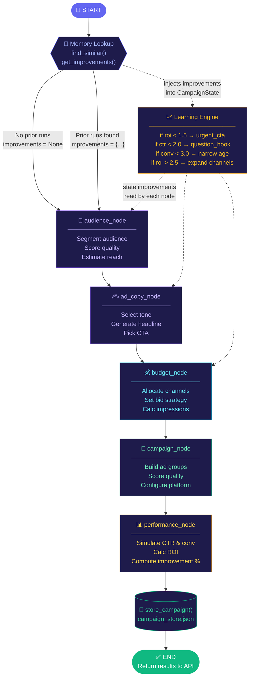

# LangGraph Flow Architecture — Agentic Growth OS

## Overview

The backend uses **LangGraph `StateGraph`** to orchestrate a sequential pipeline of 5 AI agent nodes. Every node reads from a shared `CampaignState` TypedDict and writes its output back into it. The state flows through the graph like a river — each node enriches it before passing it downstream.

---

## Graph Topology

```
                         ┌─────────────────────────────────────────────────────────┐
                         │               LangGraph StateGraph                      │
                         │                                                         │
   HTTP POST             │                                                         │
  /execute-workflow ────►│  ┌──────────┐                                          │
                         │  │  START   │                                           │
                         │  └────┬─────┘                                          │
                         │       │  CampaignState (initial)                       │
                         │       ▼                                                 │
                         │  ┌────────────────────────────────────────────────┐    │
                         │  │  audience_node                                 │    │
                         │  │  ─────────────────────────────────────────     │    │
                         │  │  reads:  campaign_type, budget,                │    │
                         │  │          target_audience, improvements         │    │
                         │  │  writes: audience_output, agent_log,           │    │
                         │  │          all_insights                          │    │
                         │  └────────────────────┬───────────────────────────┘    │
                         │                       │                                │
                         │                       ▼                                │
                         │  ┌────────────────────────────────────────────────┐    │
                         │  │  ad_copy_node                                  │    │
                         │  │  ─────────────────────────────────────────     │    │
                         │  │  reads:  campaign_type, product_name,          │    │
                         │  │          audience_output, improvements         │    │
                         │  │  writes: ad_copy_output, agent_log,            │    │
                         │  │          all_insights                          │    │
                         │  └────────────────────┬───────────────────────────┘    │
                         │                       │                                │
                         │                       ▼                                │
                         │  ┌────────────────────────────────────────────────┐    │
                         │  │  budget_node                                   │    │
                         │  │  ─────────────────────────────────────────     │    │
                         │  │  reads:  campaign_type, budget,                │    │
                         │  │          audience_output, improvements         │    │
                         │  │  writes: budget_output, agent_log,             │    │
                         │  │          all_insights                          │    │
                         │  └────────────────────┬───────────────────────────┘    │
                         │                       │                                │
                         │                       ▼                                │
                         │  ┌────────────────────────────────────────────────┐    │
                         │  │  campaign_node                                 │    │
                         │  │  ─────────────────────────────────────────     │    │
                         │  │  reads:  campaign_type, platform,              │    │
                         │  │          ad_copy_output, budget_output,        │    │
                         │  │          audience_output, improvements         │    │
                         │  │  writes: campaign_output, agent_log,           │    │
                         │  │          all_insights                          │    │
                         │  └────────────────────┬───────────────────────────┘    │
                         │                       │                                │
                         │                       ▼                                │
                         │  ┌────────────────────────────────────────────────┐    │
                         │  │  performance_node                              │    │
                         │  │  ─────────────────────────────────────────     │    │
                         │  │  reads:  ALL prior outputs + improvements      │    │
                         │  │  writes: metrics, improvement_percentage,      │    │
                         │  │          performance_grade, forecast_30_days,  │    │
                         │  │          agent_log, all_insights               │    │
                         │  └────────────────────┬───────────────────────────┘    │
                         │                       │                                │
                         │                       ▼                                │
                         │  ┌──────────┐                                          │
                         │  │   END    │                                          │
                         │  └──────────┘                                          │
                         └─────────────────────────────────────────────────────────┘
                                    │
                                    │ final_state
                                    ▼
                         ┌──────────────────────┐       ┌───────────────────────┐
                         │  store_campaign()     │──────►│  campaign_store.json  │
                         │  (if learning_mode)   │       │  (Memory Store)       │
                         └──────────────────────┘       └───────────────────────┘
```

---

## CampaignState — Shared Data Flowing Through the Graph

```
CampaignState (TypedDict)
│
├── ── INPUTS (set before graph.invoke) ───────────────────────────────────────
│   campaign_type        : "real_estate" | "coaching" | "ecommerce" | "custom"
│   product_name         : str
│   budget               : float
│   target_audience      : str
│   key_benefit          : str
│   platform             : "google_ads" | "meta_ads" | "both"
│   learning_mode        : bool
│
├── ── MEMORY CONTEXT (injected before graph.invoke) ───────────────────────────
│   improvements         : Dict | None      ← derived from campaign_store.json
│   similar_campaigns_found : int
│   learning_applied     : bool
│
├── ── NODE OUTPUTS (written as graph executes) ─────────────────────────────────
│   audience_output      : { audience_profile, estimated_reach,
│   │                        audience_quality_score, segments_identified }
│   │
│   ad_copy_output       : { headline, description, cta,
│   │                        tone_applied, headline_strategy,
│   │                        predicted_ctr_lift }
│   │
│   budget_output        : { allocation, breakdown, daily_budget,
│   │                        bid_strategy, efficiency_gain_pct }
│   │
│   campaign_output      : { platform, campaign_status, ad_groups,
│   │                        quality_score, campaign_type_selected }
│   │
│   performance_output   : { metrics, improvement_percentage,
│                             performance_grade, forecast_30_days }
│
└── ── AGGREGATED OUTPUTS (accumulated across all nodes) ───────────────────────
    agent_log            : List[{ agent, status, insights }]
    all_insights         : List[str]
    metrics              : { ctr, conversion_rate, roi_score, ... }
    improvement_percentage : float | None
    performance_grade    : "A+" | "A" | "B+" | "B" | "C" | "D"
    forecast_30_days     : { projected_conversions, projected_revenue, projected_roi }
    agent_decisions      : { tone_used, headline, budget_split, bid_strategy, ... }
    learning_summary     : { message, type, changes_applied, improvement_percentage }
```

---

## Learning Loop — How Memory Feeds Back into the Graph

```
                  ┌───────────────────────────────────────────────────┐
                  │             AUTO-LEARNING FEEDBACK LOOP           │
                  └───────────────────────────────────────────────────┘

  RUN 1 (no prior memory)
  ─────────────────────────────────────────────────────────────────────
  API Request ──► find_similar() ──► [] empty
                                          │
                                          ▼
                              improvements = None
                                          │
                              graph.invoke(state)
                                          │
                              All nodes use DEFAULT logic
                                          │
                              store_campaign(metrics, decisions)
                                          │
                                          ▼
                              campaign_store.json ◄── baseline stored


  RUN 2 (memory exists)
  ─────────────────────────────────────────────────────────────────────
  API Request ──► find_similar() ──► [{ campaign: {...}, similarity: 0.67 }]
                                          │
                                          ▼
                              get_improvements(similar)
                                          │
                    ┌─────────────────────┼─────────────────────────────┐
                    │                     │                             │
                    ▼                     ▼                             ▼
           tone_recommendation    budget_reallocation        audience_refinement
           ─────────────────      ─────────────────────      ────────────────────
           if roi < 1.5           if roi < 1.5               if conv < 3.0
             → "urgent_cta"         search: 0.60               age: "28-40"
           elif ctr < 2.5           display: 0.20              refined: true
             → "emotional_         social: 0.20
               storytelling"     elif roi > 2.5
           else                    search: 0.40
             → "benefit_focused"   display: 0.30
                                   social: 0.30

                    │                     │                             │
                    └─────────────────────┼─────────────────────────────┘
                                          │
                                          ▼
                              improvements dict injected
                              into initial CampaignState
                                          │
                              graph.invoke(state)
                                          │
                    ┌─────────────────────┼─────────────────────────────┐
                    ▼                     ▼                             ▼
           audience_node          ad_copy_node                  budget_node
           reads improvements     reads improvements            reads improvements
           → refines age group    → applies new tone            → reallocates channels
           → boosts quality score → upgrades headline strategy  → adjusts bid strategy
                    │                     │                             │
                    └─────────────────────┴─────────────────────────────┘
                                          │
                                          ▼
                              performance_node
                              calculates improvement_percentage
                              vs stored baseline roi
                                          │
                              store_campaign() ──► updated memory
                                          │
                                          ▼
                              Response: "Improved by X%"
```

---

## Node Responsibilities

### `audience_node`
```
Input from state:
  campaign_type, budget, target_audience, improvements

Logic:
  1. Look up PROFILES[campaign_type] for base audience config
  2. If improvements.audience_refinement.refined == True:
       override age_group with narrowed range from memory
  3. Calculate estimated_reach with learning boost multiplier
  4. Score audience quality (7.2–9.5 range + 0.3 if learning)

Output written to state:
  audience_output: {
    audience_profile: { age_group, income_level, interests,
                        pain_points, platform_split, best_hours },
    estimated_reach,
    audience_quality_score,
    segments_identified
  }
```

### `ad_copy_node`
```
Input from state:
  campaign_type, product_name, audience_output, improvements

Logic:
  1. Determine tone:
       default  → "professional"
       learning → improvements.tone_recommendation
  2. Select headline from COPY_TEMPLATES[campaign_type][tone]
  3. Override headline based on headline_strategy:
       "question_hook"    → QUESTION_HOOKS[campaign_type]
       "testimonial_style"→ TESTIMONIAL_HEADS[campaign_type]
       "number_lead"      → NUMBER_LEADS[campaign_type]
  4. Calculate predicted CTR lift (0.4–1.2% if learning applied)

Output written to state:
  ad_copy_output: {
    headline, description, cta,
    tone_applied, headline_strategy,
    predicted_ctr_lift
  }
```

### `budget_node`
```
Input from state:
  campaign_type, budget, audience_output, improvements

Logic:
  1. Start with BASE[campaign_type] channel split
  2. If improvements.budget_reallocation:
       override split percentages from memory recommendation
  3. Calculate per-channel breakdown:
       amount = budget × percentage
       impressions = amount × IMP_PER_RUPEE[channel]
       clicks      = amount × CLK_PER_RUPEE[channel]
  4. Determine bid_strategy:
       learning + roi > 2.0 → "target_roas"
       learning + roi > 1.2 → "maximize_conversions"
       else                 → BID_STRATEGIES[campaign_type]

Output written to state:
  budget_output: {
    allocation, breakdown, daily_budget,
    bid_strategy, efficiency_gain_pct
  }
```

### `campaign_node`
```
Input from state:
  campaign_type, platform, ad_copy_output,
  budget_output, audience_output, improvements

Logic:
  1. Look up PLATFORMS[platform] for config
  2. Calculate quality score (6–10 range + 0.5 if learning)
  3. Build ad_groups from AD_GROUPS[campaign_type]
     (focus to top 3 groups when learning applied)

Output written to state:
  campaign_output: {
    platform, campaign_status,
    ad_groups, quality_score,
    campaign_type_selected,
    estimated_impressions_daily
  }
```

### `performance_node`
```
Input from state:
  campaign_type, budget, audience_output,
  ad_copy_output, budget_output, improvements

Logic:
  1. Load BASELINE[campaign_type] metrics
  2. Apply tone lift multiplier from TONE_LIFT[tone_applied]
  3. Apply audience quality boost = (quality_score - 7.0) × 0.05
  4. If learning_applied:
       add random boost_ctr  (0.3–0.8%)
       add random boost_conv (0.4–1.0%)
       add learning_boost_roi (0.15–0.45)
  5. Calculate derived metrics:
       total_clicks = budget / cpc
       impressions  = total_clicks / (ctr / 100)
       conversions  = total_clicks × (conv / 100)
       revenue      = conversions × AOV[campaign_type]
       roi          = revenue / budget
  6. If improvements exist:
       improvement_pct = ((roi - previous_roi) / previous_roi) × 100

Output written to state:
  metrics, improvement_percentage,
  performance_grade, forecast_30_days
```

---

## Mermaid Diagram



---

## State Mutation Trace — Single Run Example

```
BEFORE graph.invoke():
  state = {
    campaign_type: "real_estate",
    budget: 50000,
    improvements: {
      tone_recommendation: "urgent_cta",
      budget_reallocation: { search_ads: 0.60, ... },
      audience_refinement: { age_group: "28-40", refined: true },
      headline_strategy:   "question_hook",
      previous_roi: 1.8
    },
    learning_applied: true,
    audience_output:  None,  ← not yet populated
    ad_copy_output:   None,
    budget_output:    None,
    campaign_output:  None,
    performance_output: None,
    agent_log:        [],
    all_insights:     []
  }

AFTER audience_node:
  state.audience_output = {
    audience_profile: { age_group: "28-40",  ← refined by learning
                        interests: [...], ... },
    estimated_reach: 56000,               ← +12% from learning boost
    audience_quality_score: 8.9           ← boosted
  }
  state.agent_log = [{ agent: "Audience Agent", ... }]

AFTER ad_copy_node:
  state.ad_copy_output = {
    headline: "Tired of Paying Rent with Nothing to Show?",  ← question_hook
    tone_applied: "urgent_cta",                              ← from improvements
    headline_strategy: "question_hook",
    predicted_ctr_lift: 0.73
  }

AFTER budget_node:
  state.budget_output = {
    allocation: { search_ads: 0.60, display_ads: 0.20, social_ads: 0.20 },
    bid_strategy: "maximize_conversions",
    efficiency_gain_pct: 14.2
  }

AFTER campaign_node:
  state.campaign_output = {
    quality_score: 8.7,
    ad_groups: [ "Ready to Move", "Investment Properties", "Luxury Segment" ],
    campaign_type_selected: "Search"
  }

AFTER performance_node:
  state.metrics = {
    ctr: 3.24,
    conversion_rate: 4.51,
    roi_score: 5.47,
    impressions: 52000,
    clicks: 1684,
    conversions: 76
  }
  state.improvement_percentage = 74.8    ← vs previous_roi of 1.8
  state.performance_grade = "A+"
```

---

## File Map

```
backend/
├── graph/
│   ├── state.py              ← CampaignState TypedDict (the shared data contract)
│   ├── workflow.py           ← StateGraph definition, edges, compile()
│   └── nodes/
│       ├── audience_node.py  ← Node 1 of 5
│       ├── ad_copy_node.py   ← Node 2 of 5
│       ├── budget_node.py    ← Node 3 of 5
│       ├── campaign_node.py  ← Node 4 of 5
│       └── performance_node.py ← Node 5 of 5 (computes improvement %)
│
├── memory/
│   ├── campaign_memory.py    ← find_similar(), store_campaign(), get_improvements()
│   └── campaign_store.json   ← auto-created, grows with every run
│
└── main.py                   ← FastAPI, invokes graph, handles memory read/write
```

---

## Key Design Decisions

| Decision | Reason |
|---|---|
| Sequential graph (not parallel) | LangGraph 0.6 raises `InvalidUpdateError` when two nodes write to the same state key concurrently. Sequential avoids the conflict while keeping full data flow. |
| TypedDict state (not Pydantic) | LangGraph requires `TypedDict` or `dataclass` for `StateGraph` — Pydantic models are not directly supported as graph state. |
| Memory outside the graph | The memory lookup (`find_similar`) and write (`store_campaign`) happen in `main.py`, not inside graph nodes. This keeps nodes pure and stateless — easier to test and swap. |
| JSON flat-file store | Zero external dependencies for the demo. Swap `_load/_save` in `campaign_memory.py` to use SQLite or PostgreSQL without touching any node code. |
| Improvements injected as initial state | The whole improvements dict is passed in `state["improvements"]` before `graph.invoke()`. Every node that needs it reads from this key — no node needs to call the memory store directly. |
