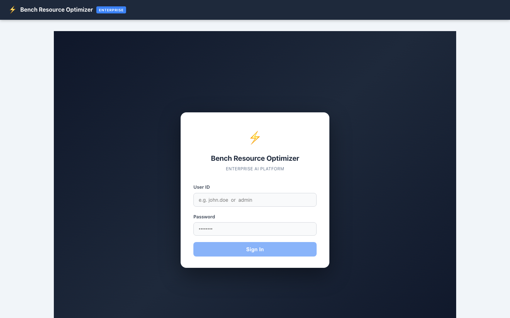
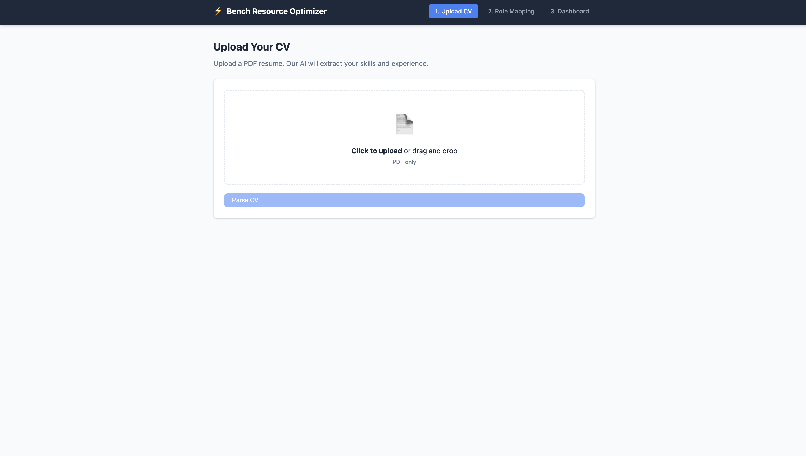
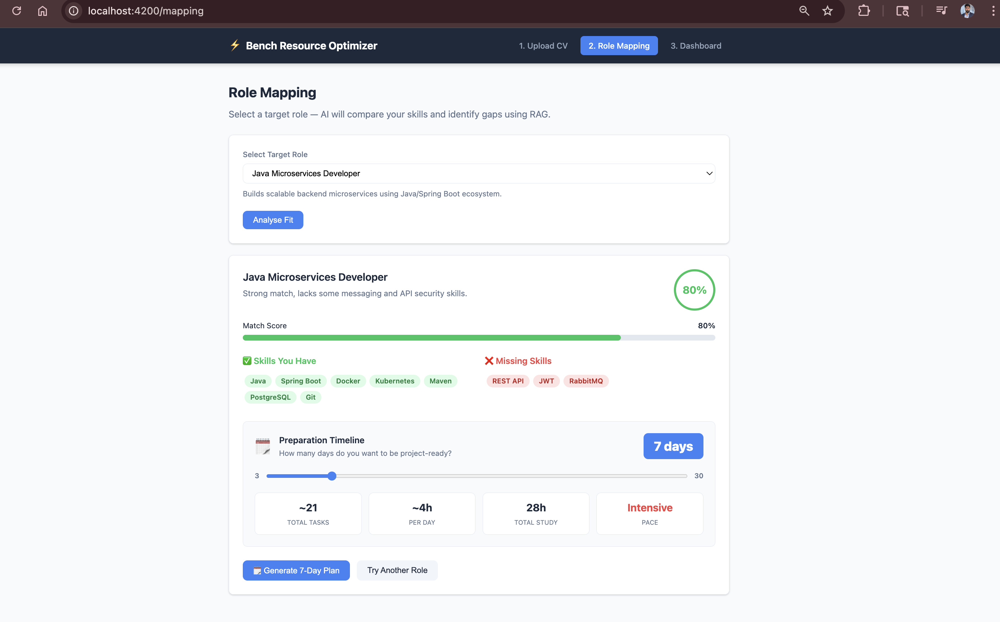
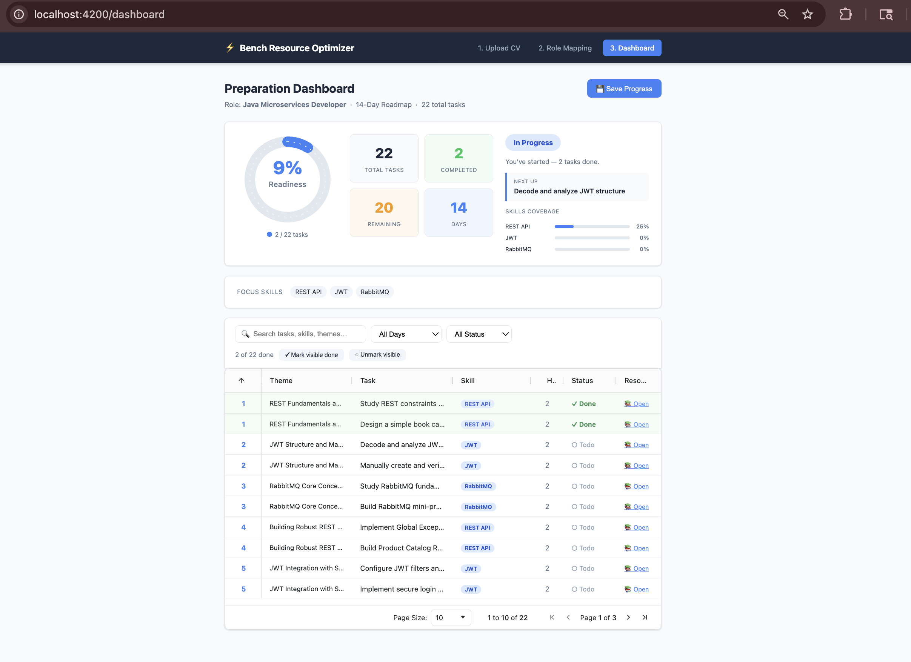

# Bench Resource Optimizer — Demo Guide

> **Enterprise AI Platform** — Helps organisations identify skill gaps for bench employees and generate personalised AI-powered training plans.

---

## Quick Start

| | |
|---|---|
| **Frontend UI** | http://localhost:4200 |
| **Backend API** | http://localhost:8000 |
| **Swagger Docs** | http://localhost:8000/docs |

### Credentials

| Role | User ID | Password |
|------|---------|----------|
| Regular User | `user` | `BenchUs3r@2026` |
| Admin | `admin` | `BenchAdm!n@2026` |

### Start the Application

```bash
# From the project root
cd bench-resource-optimizer

# Start backend
cd backend
source ../.venv/bin/activate
uvicorn main:app --reload --host 0.0.0.0 --port 8000

# Start frontend (new terminal)
cd frontend
ng serve --proxy-config proxy.conf.json --port 4200
```

---

## Complete User Flow — Step by Step

---

### Step 1 — Login

**URL:** `http://localhost:4200/login`



**What you see:**
- Bench Resource Optimizer Enterprise landing page
- User ID and Password fields
- Sign In button

**How to test:**
1. Enter User ID: `user`
2. Enter Password: `BenchUs3r@2026`
3. Click **Sign In**
4. You are redirected to the **Upload CV** page

> To test admin features, login with `admin` / `BenchAdm!n@2026`

---

### Step 2 — Upload CV

**URL:** `http://localhost:4200/upload`



**What you see:**
- Drag-and-drop PDF upload zone
- "Click to upload or drag and drop — PDF only" instructions
- **Parse CV** button
- Navigation bar showing the 3-step flow: Upload CV → Role Mapping → Dashboard

**What happens behind the scenes:**
- PDF is text-extracted locally (no raw bytes sent to LLM)
- DeepSeek LLM parses: name, email, phone, skills, experience years, roles, projects, education
- Security injection check runs on extracted text
- G1 rate limiter checks per-user quota
- Result stored in SQLite, Kafka event fired

**How to test:**
1. Click the upload zone or drag a PDF resume onto it
2. Click **Parse CV**
3. Wait 3–5 seconds for AI parsing
4. You are automatically taken to the **Role Mapping** page

> Any PDF resume works. Use a real CV or generate a sample one.

---

### Step 3 — Role Mapping

**URL:** `http://localhost:4200/mapping`



**What you see:**
- **Select Target Role** dropdown (e.g. Java Microservices Developer)
- Role description beneath the selection
- **Analyse Fit** button
- After analysis:
  - Match Score percentage (e.g. 80%)
  - **Skills You Have** — green tags (Java, Spring Boot, Docker…)
  - **Missing Skills** — red tags (REST API, JWT, RabbitMQ…)
  - Preparation Timeline slider (3–30 days)
  - Stats: Total Tasks, Per Day hours, Total Study hours, Pace
  - **Generate 7-Day Plan** button

**What happens behind the scenes:**
- HyDE: LLM generates a hypothetical role document for better retrieval
- Hybrid search: BM25 + FAISS vector store + Reciprocal Rank Fusion
- CRAG quality scoring — falls back if retrieval is poor
- LLM maps candidate skills to role requirements
- Faithfulness check on LLM output
- G4 PII filter scrubs personal data from response
- L1 exact cache — identical requests return instantly

**How to test:**
1. Select a role from the dropdown (e.g. `Java Microservices Developer`)
2. Click **Analyse Fit**
3. Review your match score, matched skills, and missing skills
4. Adjust the timeline slider to choose days (default 7)
5. Click **Generate 7-Day Plan**

---

### Step 4 — Training Plan & Progress Dashboard

**URL:** `http://localhost:4200/dashboard`



**What you see:**
- **Preparation Dashboard** header with role name and total tasks
- **Readiness Score** circular gauge (e.g. 9% → grows as you complete tasks)
- Stats: Total Tasks, Completed, Remaining, Days
- **Next Up** — the next recommended task
- **Skills Coverage** — progress bars per skill (REST API, JWT, RabbitMQ)
- **Focus Skills** filter chips
- Task table with columns: Theme, Task, Skill, Hours, Status, Resource
- Pagination controls
- **Save Progress** button

**What happens behind the scenes:**
- Two-phase async plan generation (Phase 1: day themes, Phase 2: N parallel task generations)
- In-memory cache — same role+skills combo returns in milliseconds on repeat
- Internal resource links injected per skill (never public internet URLs)
- Progress persisted to SQLite
- Episodic memory updated — session summary written for future context
- SSE streaming available at `/generate-plan/stream`

**How to test:**
1. Tick the checkbox on a task row to mark it complete
2. Click **Save Progress**
3. Watch the **Readiness Score** gauge increase
4. Filter by skill using the focus skill chips
5. Use the search box to find specific tasks
6. Navigate pages using the pagination controls

---

### Step 5 — Metrics & Observability

**URL:** `http://localhost:4200/metrics`

**What you see:**
- Token usage counters (prompt tokens, completion tokens, cost USD)
- Request latency per endpoint
- Cache hit rates (L1 exact, L2 semantic)
- RAGAS evaluation scores (faithfulness, context precision, answer relevancy)
- Guardrail stats (G1 rate limiter, G2 circuit breakers, G3 JSON repair, G4 PII filter, G5 degradation)

**How to test:**
1. After completing steps 2–4 above, navigate to Metrics
2. You will see real token counts and latency from your session
3. RAGAS scores update after each role mapping call

---

### Step 6 — Memory

**URL:** `http://localhost:4200/memory`

**What you see:**
- Episodic memory: last N sessions with role explored, match score, skills covered
- Long-term user facts: initial skills, covered skills, training role
- Memory context string used to personalise future LLM calls

**How to test:**
1. Complete a role mapping and plan generation (Steps 3–4)
2. Navigate to Memory
3. Your session is recorded — role explored, score, skills

---

### Step 7 — Admin Panel

**URL:** `http://localhost:4200/admin`

> Requires admin login: `admin` / `BenchAdm!n@2026`

**What you see:**
- Role management: create, update, delete roles in the knowledge base
- Upload internal training documents (PDF/TXT) → indexed into FAISS
- Circuit breaker controls: reset individual or all breakers
- Guardrail stats live view

**How to test:**
1. Login as admin
2. Navigate to Admin
3. Create a new role with required skills
4. Upload an internal training document (PDF or .txt)
5. Reset a circuit breaker

---

## API Testing via Swagger

**URL:** `http://localhost:8000/docs`

All endpoints are available with Try It Out support:

| Endpoint | Method | Purpose |
|----------|--------|---------|
| `/health/live` | GET | Is the server alive? |
| `/health/ready` | GET | Are LLM + FAISS + BM25 + DB ready? |
| `/upload-cv` | POST | Upload PDF, get parsed profile + user_id |
| `/map-role` | POST | Map user to a target role, get match score |
| `/generate-plan` | POST | Generate N-day training plan |
| `/generate-plan/stream` | POST | Same but SSE streaming day-by-day |
| `/update-progress` | POST | Mark tasks complete, get readiness score |
| `/progress/{user_id}` | GET | Get current plan + progress |
| `/metrics` | GET | Token usage, latency, cache stats |
| `/guardrails/stats` | GET | Live G1–G5 guardrail counters |
| `/ragas` | GET | RAGAS evaluation dashboard |
| `/evaluate` | POST | LLM-as-Judge score any AI output |
| `/roles` | GET | List all roles in knowledge base |
| `/admin/roles` | POST | Create a new role (admin only) |
| `/admin/upload-resource` | POST | Upload internal training doc (admin only) |

**Quick Swagger test:**
1. Open http://localhost:8000/docs
2. Click `POST /upload-cv` → Try it out → upload a PDF
3. Copy the `user_id` from the response
4. Click `POST /map-role` → paste `user_id`, set `target_role`
5. Click `POST /generate-plan` → paste `user_id`, add `missing_skills`

---

## Architecture Overview

```
Angular UI (port 4200)
        │  proxy /api → localhost:8000
        ▼
FastAPI Backend (port 8000)
        │
        ├── CV Parser Agent      ← DeepSeek LLM + security guardrails
        ├── Role Mapping Agent   ← HyDE + BM25/FAISS hybrid + CRAG + faithfulness
        ├── Planning Agent       ← Async parallel day generation + internal resources
        ├── Tracking Agent       ← Readiness scoring
        │
        ├── RAG Layer            ← BM25 + FAISS + RRF + Cross-encoder reranker
        ├── Cache Layer          ← L1 exact hash + L2 semantic similarity
        ├── Memory Layer         ← Episodic (SQLite) + Long-term user facts
        ├── Guardrails (G1–G5)   ← Rate limit, circuit breaker, JSON repair, PII, degradation
        ├── Observability        ← Token tracker, RAGAS eval, metrics collector
        └── SQLite DB            ← Users, roles, progress, memory, RAGAS results
```

---

## SonarQube Quality Report

| Metric | Value |
|--------|-------|
| Quality Gate | **PASSED** |
| Coverage | **94.7%** (502 tests) |
| Bugs | **0** |
| Vulnerabilities | **0** |
| Code Smells | **0** |
| Security Hotspots | **0** |
| Reliability | **A** |
| Security | **A** |
| Maintainability | **A** |
