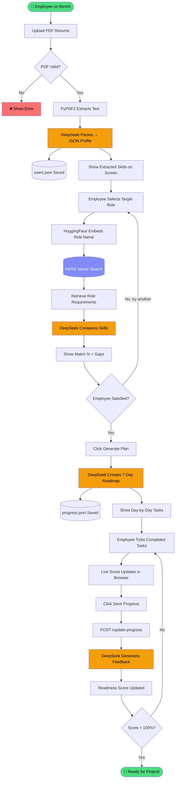

# 🔍 Complete System Flow — Bench Resource Optimizer

> **For everyone** — this document explains how the entire system works, from the moment
> an employee uploads their CV to the moment they see a readiness score.
> No technical background required.

---

## 📖 What Problem Does This Solve?

Imagine a software company with 50 employees "on the bench" — meaning they finished
their last project and are waiting for a new one.

The manager has no idea:
- What skills does each person have?
- Which project role are they best suited for?
- What are they missing to fit that role?
- How prepared are they *right now*?

This system answers all four questions — automatically — using AI.

---

## 🗺️ The Big Picture (30,000 ft View)

```
┌─────────────────────────────────────────────────────────────────────────────┐
│                         BENCH RESOURCE OPTIMIZER                            │
│                                                                             │
│   EMPLOYEE                   SYSTEM                          MANAGER        │
│   ─────────                  ──────                          ───────        │
│                                                                             │
│   Uploads CV  ──────────►  Reads & Understands CV                          │
│                                                                             │
│   Picks Role  ──────────►  Checks Skill Fit (AI + Knowledge Base)          │
│                                                                             │
│   Gets Plan   ◄──────────  Creates 7-Day Learning Roadmap                  │
│                                                                             │
│   Ticks Tasks ──────────►  Calculates Readiness Score  ──────► Dashboard   │
│                                                                             │
└─────────────────────────────────────────────────────────────────────────────┘
```

---

## 🚶 User Journey — Step by Step (Plain English)

```
╔══════════════════════════════════════════════════════════════════════════════╗
║  STEP 1                          STEP 2                       STEP 3        ║
║                                                                             ║
║  [ Upload Your CV ]      [ Pick a Target Role ]      [ See Your Dashboard ] ║
║                                                                             ║
║  • Drag & drop PDF       • Choose from 6 roles       • View 7-day plan     ║
║  • AI reads it           • AI compares your          • Tick off tasks      ║
║  • Shows your skills,      skills vs role needs      • Watch score grow    ║
║    experience, projects  • Shows % match             • Save progress       ║
║                          • Shows what's missing                            ║
╚══════════════════════════════════════════════════════════════════════════════╝
```

---

## 🏗️ Full System Architecture

```
╔══════════════════════╗         HTTP Requests          ╔══════════════════════╗
║                      ║  ◄────────────────────────►  ║                      ║
║   ANGULAR FRONTEND   ║                               ║   FASTAPI BACKEND    ║
║   (What you see)     ║                               ║   (The brain)        ║
║                      ║                               ║                      ║
║  ┌────────────────┐  ║                               ║  ┌────────────────┐  ║
║  │ Screen 1       │  ║  POST /upload-cv              ║  │ CV Parser      │  ║
║  │ Upload CV      │──╬──────────────────────────────►║  │ Agent (AI)     │  ║
║  └────────────────┘  ║                               ║  └───────┬────────┘  ║
║                      ║                               ║          │           ║
║  ┌────────────────┐  ║                               ║          ▼           ║
║  │ Screen 2       │  ║  POST /map-role               ║  ┌────────────────┐  ║
║  │ Role Mapping   │──╬──────────────────────────────►║  │ Role Mapping   │  ║
║  └────────────────┘  ║                               ║  │ Agent (AI+RAG) │  ║
║                      ║                               ║  └───────┬────────┘  ║
║  ┌────────────────┐  ║  POST /generate-plan          ║          │           ║
║  │ Screen 3       │  ║◄─────────────────────────────╬──        ▼           ║
║  │ Dashboard      │  ║                               ║  ┌────────────────┐  ║
║  │                │  ║  POST /update-progress        ║  │ Planning Agent │  ║
║  │ [✓] Task 1     │──╬──────────────────────────────►║  │ (AI)           │  ║
║  │ [ ] Task 2     │  ║                               ║  └───────┬────────┘  ║
║  │ [ ] Task 3     │  ║                               ║          │           ║
║  │                │  ║                               ║          ▼           ║
║  │ Readiness: 42% │  ║                               ║  ┌────────────────┐  ║
║  └────────────────┘  ║                               ║  │ Tracking Agent │  ║
║                      ║                               ║  │ (Score Calc)   │  ║
╚══════════════════════╝                               ╚══════════╪═══════════╝
                                                                  │
                                    ┌─────────────────────────────┘
                                    │
                        ┌───────────▼────────────────────────────────┐
                        │              AI + STORAGE LAYER             │
                        │                                             │
                        │   ┌──────────────┐   ┌──────────────────┐  │
                        │   │   DeepSeek   │   │  FAISS Vector DB │  │
                        │   │   LLM (AI)   │   │  (Role Skills KB)│  │
                        │   └──────────────┘   └──────────────────┘  │
                        │                                             │
                        │   ┌──────────────┐   ┌──────────────────┐  │
                        │   │  users.json  │   │  progress.json   │  │
                        │   │  (profiles)  │   │  (task state)    │  │
                        │   └──────────────┘   └──────────────────┘  │
                        └─────────────────────────────────────────────┘
```

---

## 🤖 The Four AI Agents — Who Does What?

Think of agents as specialists on a team. Each one has a single job.

```
┌──────────────────────────────────────────────────────────────────────────────┐
│                          THE AI AGENT TEAM                                   │
├──────────────────┬───────────────────────────┬──────────────────────────────┤
│  AGENT           │  INPUT                    │  OUTPUT                      │
├──────────────────┼───────────────────────────┼──────────────────────────────┤
│  🔍 CV Parser    │  Raw PDF text             │  Structured profile:         │
│                  │  (messy, unstructured)    │  { skills, experience,       │
│                  │                           │    roles, projects }         │
├──────────────────┼───────────────────────────┼──────────────────────────────┤
│  🎯 Role Mapper  │  Your profile +           │  Match percentage,           │
│                  │  Role requirements        │  Skills you have ✅           │
│                  │  (from knowledge base)    │  Skills you're missing ❌     │
├──────────────────┼───────────────────────────┼──────────────────────────────┤
│  📅 Planner      │  Target role +            │  7-day plan:                 │
│                  │  Missing skills           │  Day 1: Topic + 3 tasks      │
│                  │                           │  Day 2: Topic + 3 tasks ...  │
├──────────────────┼───────────────────────────┼──────────────────────────────┤
│  📊 Tracker      │  Plan + Completed tasks   │  Readiness score (0-100%)    │
│                  │                           │  Status + Next task tip      │
└──────────────────┴───────────────────────────┴──────────────────────────────┘
```

---

## 🔄 The Complete Data Flow (End to End)

```
  ┌──────────┐
  │ Employee │
  │  (User)  │
  └────┬─────┘
       │
       │  1. Uploads resume.pdf
       ▼
  ┌─────────────────────────────────────────────────┐
  │                  STEP 1: CV PARSING              │
  │                                                  │
  │  PDF File                                        │
  │     │                                            │
  │     ▼                                            │
  │  PyPDF2 extracts raw text                        │
  │     │                                            │
  │     ▼                                            │
  │  "John has 3 years of experience in Java,        │
  │   Spring Boot. Worked at TCS on billing          │
  │   system. B.Tech in CS from VIT..."              │
  │     │                                            │
  │     ▼                                            │
  │  DeepSeek AI reads the text and extracts:        │
  │                                                  │
  │  {                                               │
  │    "name": "John",                               │
  │    "skills": ["Java", "Spring Boot", "Git"],     │
  │    "experience_years": 3,                        │
  │    "roles": ["Backend Developer"],               │
  │    "projects": [{"name": "Billing System"}]      │
  │  }                                               │
  │                                                  │
  │  → Saved to users.json with a unique user_id     │
  └─────────────────────────────────────────────────┘
       │
       │  2. User picks "Java Microservices Developer"
       ▼
  ┌─────────────────────────────────────────────────┐
  │              STEP 2: ROLE MAPPING (RAG)          │
  │                                                  │
  │  ┌──────────────────────────────────────────┐   │
  │  │            HOW RAG WORKS                  │   │
  │  │                                          │   │
  │  │  "Java Microservices Developer"          │   │
  │  │           │                              │   │
  │  │           ▼                              │   │
  │  │    Convert to a number-vector            │   │
  │  │    using HuggingFace embeddings          │   │
  │  │    [0.12, 0.87, 0.34, ...]               │   │
  │  │           │                              │   │
  │  │           ▼                              │   │
  │  │    Search FAISS vector database          │   │
  │  │    (like a smart search engine)          │   │
  │  │           │                              │   │
  │  │           ▼                              │   │
  │  │    Finds closest match in knowledge base │   │
  │  │    "Required: Spring Boot, Docker, JWT,  │   │
  │  │     REST API, Kubernetes, Maven..."      │   │
  │  └──────────────────────────────────────────┘   │
  │                    │                             │
  │                    ▼                             │
  │     DeepSeek AI compares:                        │
  │     John's skills  vs  Role requirements         │
  │     [Java ✅, Spring Boot ✅, Docker ❌, JWT ❌]  │
  │                    │                             │
  │                    ▼                             │
  │     Output:                                      │
  │     • Match: 40%                                 │
  │     • Has: Java, Spring Boot, Git               │
  │     • Missing: Docker, JWT, Kubernetes, Maven    │
  └─────────────────────────────────────────────────┘
       │
       │  3. User clicks "Generate Plan"
       ▼
  ┌─────────────────────────────────────────────────┐
  │              STEP 3: PLAN GENERATION             │
  │                                                  │
  │  Input to AI:                                    │
  │  • Role: Java Microservices Developer            │
  │  • Missing: Docker, JWT, Kubernetes, Maven       │
  │  • Already knows: Java, Spring Boot, Git         │
  │                                                  │
  │  DeepSeek generates a 7-day plan:                │
  │                                                  │
  │  Day 1 ── Docker Basics                         │
  │           ├── Task 1: Install Docker, run hello  │
  │           ├── Task 2: Build your first image     │
  │           └── Task 3: Mini project: dockerize app│
  │                                                  │
  │  Day 2 ── JWT & API Security                    │
  │           ├── Task 1: What is JWT?               │
  │           └── ...                               │
  │                                                  │
  │  ... (Days 3-7 for remaining skills)             │
  │                                                  │
  │  → Saved to progress.json                        │
  └─────────────────────────────────────────────────┘
       │
       │  4. User ticks tasks as done
       ▼
  ┌─────────────────────────────────────────────────┐
  │              STEP 4: PROGRESS TRACKING           │
  │                                                  │
  │  Completed tasks: [day1_task1, day1_task2]       │
  │  Total tasks: 21                                 │
  │                                                  │
  │  Formula:                                        │
  │  Readiness = (2 / 21) × 100 = 9%                 │
  │                                                  │
  │  AI also generates:                              │
  │  • Status: "In Progress"                         │
  │  • Message: "Great start! Tackle JWT next."      │
  │  • Next task: "What is JWT?"                     │
  │                                                  │
  │  → Updated in progress.json                      │
  └─────────────────────────────────────────────────┘
       │
       ▼
  ┌──────────┐
  │ Employee │  sees their score go up as they learn
  └──────────┘
```

---

## 🧠 What is RAG? (Explained Simply)

RAG = **R**etrieval-**A**ugmented **G**eneration

Most people know AI (like ChatGPT) from memory — it knows general things.
But it doesn't know *your company's* specific role requirements.

RAG solves this:

```
┌─────────────────────────────────────────────────────────────────────────────┐
│                        WITHOUT RAG (Pure AI)                                │
│                                                                             │
│  User: "What does a Java Dev need?"                                         │
│  AI:   "Generally... Java, OOP..." (generic, may miss your requirements)    │
└─────────────────────────────────────────────────────────────────────────────┘

┌─────────────────────────────────────────────────────────────────────────────┐
│                         WITH RAG (This System)                              │
│                                                                             │
│  Step 1: Look up OUR knowledge base first                                   │
│          → "Java Dev at our company needs: Spring Boot, Docker, JWT..."     │
│                                                                             │
│  Step 2: Give that context to the AI                                        │
│          → "Here is what WE need, now compare with John's skills"           │
│                                                                             │
│  Step 3: AI gives a precise, company-specific answer                        │
│          → "John has Java ✅ but is missing Docker ❌ and JWT ❌"            │
└─────────────────────────────────────────────────────────────────────────────┘

The FAISS database works like a very smart index card system:
  • Each role's requirements are stored as a "fingerprint" (vector)
  • When you search "Java Developer", it finds the most similar fingerprint
  • Retrieved text is handed to the AI for reasoning
```

---

## 🗂️ Knowledge Base — What Roles Are Stored?

```
┌──────────────────────────────────────────────────────────────────────────┐
│                        ROLES KNOWLEDGE BASE                               │
│                        (roles_knowledge.json)                             │
├─────────────────────────┬────────────────────────────────────────────────┤
│  ROLE                   │  REQUIRED SKILLS                               │
├─────────────────────────┼────────────────────────────────────────────────┤
│  Java Microservices Dev │  Java, Spring Boot, Docker, JWT, Kubernetes,   │
│                         │  REST API, Maven, PostgreSQL, RabbitMQ, Git    │
├─────────────────────────┼────────────────────────────────────────────────┤
│  Frontend Angular Dev   │  Angular, TypeScript, RxJS, HTML5, CSS3,       │
│                         │  REST API, Git, NgRx, Jasmine, Webpack         │
├─────────────────────────┼────────────────────────────────────────────────┤
│  Fullstack React Node   │  React, Node.js, Express.js, JavaScript,       │
│                         │  TypeScript, MongoDB, REST API, Redux, Docker  │
├─────────────────────────┼────────────────────────────────────────────────┤
│  DevOps Engineer        │  Docker, Kubernetes, Jenkins, Terraform, AWS,  │
│                         │  Linux, Git, Bash, Ansible, Prometheus         │
├─────────────────────────┼────────────────────────────────────────────────┤
│  Python Data Engineer   │  Python, PySpark, SQL, Airflow, Pandas,        │
│                         │  AWS S3, Kafka, Docker, dbt, Git               │
├─────────────────────────┼────────────────────────────────────────────────┤
│  AI/ML Engineer         │  Python, TensorFlow, PyTorch, Scikit-learn,    │
│                         │  MLflow, FastAPI, Docker, LangChain, SQL, Git  │
└─────────────────────────┴────────────────────────────────────────────────┘
                              ▲
                              │
                  Stored as vectors in FAISS
                  (semantic search enabled)
```

---

## 🖥️ Screen-by-Screen UI Flow

```
Browser opens http://localhost:4200
              │
              ▼
┌─────────────────────────────────────────────────────────────────────────────┐
│  NAVBAR: [1. Upload CV] ──── [2. Role Mapping] ──── [3. Dashboard]          │
└─────────────────────────────────────────────────────────────────────────────┘
              │
     ┌────────▼────────┐
     │                 │
     │   SCREEN 1      │
     │   UPLOAD CV     │
     │                 │
     │  ┌───────────┐  │   ← Drag-drop zone
     │  │     📄    │  │
     │  │  Drop PDF │  │
     │  └───────────┘  │
     │                 │
     │  [Parse CV →]   │   ← Calls POST /upload-cv
     │                 │
     │  After parsing: │
     │  ┌───────────┐  │
     │  │ Name: ... │  │
     │  │ Skills:   │  │
     │  │ [Java]    │  │
     │  │ [Python]  │  │
     │  │ [Docker]  │  │
     │  │ Projects  │  │
     │  └───────────┘  │
     │  [Continue →]   │   ← Navigate to Screen 2
     └────────┬────────┘
              │
     ┌────────▼────────┐
     │                 │
     │   SCREEN 2      │
     │   ROLE MAPPING  │
     │                 │
     │  Select Role:   │
     │  [▼ Java Dev  ] │   ← Dropdown of all roles
     │                 │
     │  [Analyze Fit]  │   ← Calls POST /map-role (RAG happens here)
     │                 │
     │  After analysis:│
     │                 │
     │     ╭───────╮   │
     │     │  40%  │   │   ← Animated score ring
     │     ╰───────╯   │
     │                 │
     │  ✅ Has:        │
     │  [Java][Git]    │   ← Green badges
     │                 │
     │  ❌ Missing:    │
     │  [Docker][JWT]  │   ← Red badges
     │                 │
     │  [📅 Generate   │
     │     7-Day Plan] │   ← Calls POST /generate-plan → goes to Screen 3
     └────────┬────────┘
              │
     ┌────────▼────────┐
     │                 │
     │   SCREEN 3      │
     │   DASHBOARD     │
     │                 │
     │  Readiness: 14% │   ← Live score
     │  ████░░░░░░░░░  │   ← Progress bar
     │  Status: In     │
     │  Progress       │
     │                 │
     │  Day 1: Docker  │   ← Collapsible day card
     │  ┌────────────┐ │
     │  │[✓] Task 1  │ │   ← Checkbox (click to toggle)
     │  │[ ] Task 2  │ │
     │  │[ ] Task 3  │ │
     │  └────────────┘ │
     │                 │
     │  Day 2: JWT     │
     │  Day 3: ...     │
     │                 │
     │  [💾 Save       │   ← Calls POST /update-progress
     │     Progress]   │     score refreshes
     └─────────────────┘
```

---

## 📦 How Data is Stored

```
┌──────────────────────────────────────────────────────┐
│  data/users.json  — one entry per uploaded CV        │
│                                                      │
│  {                                                   │
│    "f819a86c": {               ← unique user ID      │
│      "profile": {                                    │
│        "name": "John",                               │
│        "skills": ["Java", "Git"],                    │
│        "experience_years": 3                         │
│      }                                               │
│    }                                                 │
│  }                                                   │
└──────────────────────────────────────────────────────┘

┌──────────────────────────────────────────────────────┐
│  data/progress.json  — plan + task completion state  │
│                                                      │
│  {                                                   │
│    "f819a86c": {                                     │
│      "role": "Java Microservices Developer",         │
│      "plan": { ... full 7-day plan ... },            │
│      "completed_task_ids": [                         │
│        "day1_task1",                                 │
│        "day1_task2"                                  │
│      ]                                               │
│    }                                                 │
│  }                                                   │
└──────────────────────────────────────────────────────┘

┌──────────────────────────────────────────────────────┐
│  rag/faiss_index/  — the AI's "search index"         │
│                                                      │
│  index.faiss  ← compressed vector database          │
│  index.pkl    ← metadata (role names, skills)       │
│                                                      │
│  Built once from roles_knowledge.json                │
│  Loaded from disk on every server restart            │
└──────────────────────────────────────────────────────┘
```

---

## 🔌 API Call Map (What Happens When)

```
User Action                  API Call                   AI Agent Involved
───────────────────────────────────────────────────────────────────────────
Upload PDF            →  POST /upload-cv           →  CV Parser Agent
                                                       (DeepSeek reads PDF)

Select role           →  POST /map-role            →  Role Mapper Agent
  + click Analyze Fit        (RAG searches FAISS)      (DeepSeek compares)

Click Generate Plan   →  POST /generate-plan       →  Planning Agent
                                                       (DeepSeek writes plan)

Tick a checkbox       →  (local only, no API)      →  score updates live
                                                       in the browser

Click Save Progress   →  POST /update-progress     →  Tracking Agent
                                                       (DeepSeek + formula)

Page refresh          →  GET /progress/{user_id}   →  No AI, just storage
```

---

## ⚡ Technology Choices Explained Simply

```
┌─────────────────────┬───────────────────────────────────────────────────────┐
│  TECHNOLOGY         │  WHAT IT DOES (Plain English)                         │
├─────────────────────┼───────────────────────────────────────────────────────┤
│  FastAPI (Python)   │  The "waiter" — takes requests from the browser,      │
│                     │  passes to the kitchen (AI), returns the result       │
├─────────────────────┼───────────────────────────────────────────────────────┤
│  DeepSeek LLM       │  The "brain" — reads and understands text, generates  │
│                     │  structured answers, plans, and feedback              │
├─────────────────────┼───────────────────────────────────────────────────────┤
│  LangChain          │  The "connector" — lets Python code talk to AI models │
│                     │  using reusable prompts and chains                    │
├─────────────────────┼───────────────────────────────────────────────────────┤
│  FAISS              │  A "similarity search engine" — finds the closest     │
│                     │  match in the knowledge base using math vectors       │
├─────────────────────┼───────────────────────────────────────────────────────┤
│  HuggingFace        │  The "translator" — converts role names into numbers  │
│  Embeddings         │  (vectors) so FAISS can search them                   │
├─────────────────────┼───────────────────────────────────────────────────────┤
│  Angular            │  The "shop window" — the visual interface the user    │
│                     │  sees and clicks on in the browser                    │
├─────────────────────┼───────────────────────────────────────────────────────┤
│  JSON files         │  A simple "notebook" to remember user data and        │
│                     │  progress across page refreshes                       │
├─────────────────────┼───────────────────────────────────────────────────────┤
│  PyPDF2             │  A "PDF reader" — pulls out the text content from     │
│                     │  uploaded resume files                                │
└─────────────────────┴───────────────────────────────────────────────────────┘
```

---

## 📊 Readiness Score — How It's Calculated

```
Total tasks in the 7-day plan = 21  (3 tasks × 7 days)

After completing Day 1 (3 tasks):
  Score = 3 ÷ 21 × 100 = 14%   →  "Not Started" → "In Progress"

After completing Days 1-3 (9 tasks):
  Score = 9 ÷ 21 × 100 = 43%   →  "In Progress"

After completing Days 1-6 (18 tasks):
  Score = 18 ÷ 21 × 100 = 86%  →  "Almost Ready"

After all 21 tasks:
  Score = 21 ÷ 21 × 100 = 100% →  "Ready" 🎉

Status Labels:
  0%        →  Not Started
  1–49%     →  In Progress
  50–84%    →  Almost Ready
  85–100%   →  Ready
```

---

## 🔁 Sequence Diagram (Full Conversation)

```
Employee      Browser        FastAPI       DeepSeek AI       FAISS DB
   │             │              │               │                │
   │─ Opens ────►│              │               │                │
   │             │─ GET /roles ►│               │                │
   │             │◄─ 6 roles ──│               │                │
   │             │              │               │                │
   │─ Drops PDF ►│              │               │                │
   │             │─ POST        │               │                │
   │             │  /upload-cv ►│               │                │
   │             │              │─ extract text │                │
   │             │              │─ send prompt ►│                │
   │             │              │◄ JSON profile │                │
   │             │◄─ profile ──│               │                │
   │             │              │               │                │
   │─ Picks role►│              │               │                │
   │             │─ POST        │               │                │
   │             │  /map-role ─►│               │                │
   │             │              │─ embed query ─┼───────────────►│
   │             │              │◄ role context─┼────────────────│
   │             │              │─ send prompt ►│                │
   │             │              │◄ match result─│                │
   │             │◄─ mapping ──│               │                │
   │             │              │               │                │
   │─ Click plan►│              │               │                │
   │             │─ POST        │               │                │
   │             │  /generate   │               │                │
   │             │  -plan ─────►│               │                │
   │             │              │─ send prompt ►│                │
   │             │              │◄ 7-day plan ──│                │
   │             │◄─ plan ─────│               │                │
   │             │              │               │                │
   │─ Ticks ────►│              │               │                │
   │  checkboxes │ (score live  │               │                │
   │             │  in browser) │               │                │
   │             │              │               │                │
   │─ Save ─────►│              │               │                │
   │             │─ POST        │               │                │
   │             │  /update     │               │                │
   │             │  -progress ─►│               │                │
   │             │              │─ send prompt ►│                │
   │             │              │◄ score+status─│                │
   │             │◄─ readiness ─│               │                │
   │◄─ sees 42% ─│              │               │                │
```

---

## 🌐 Mermaid Flowchart (renders on GitHub / Notion)



---

## 📁 File Map — What Each File Does

```
bench-resource-optimizer/
│
├── 📄 README.md              ← Setup & run instructions
├── 📄 FLOW.md                ← This file — full system explanation
├── 🚀 run.sh                 ← One command to start everything
│
├── backend/
│   │
│   ├── 🎯 main.py            ← The server. Defines all 6 API endpoints.
│   │                           Starts FAISS and DeepSeek on boot.
│   │
│   ├── 💾 storage.py         ← Read/write users.json and progress.json
│   │
│   ├── agents/
│   │   ├── 🔍 cv_parser_agent.py      ← Prompt: PDF text → JSON
│   │   ├── 🎯 role_mapping_agent.py   ← Prompt: profile + RAG → match %
│   │   ├── 📅 planning_agent.py       ← Prompt: gaps → 7-day plan
│   │   └── 📊 tracking_agent.py       ← Formula + Prompt: score + tip
│   │
│   ├── rag/
│   │   └── 🧲 knowledge_base.py  ← Builds/loads FAISS index from JSON
│   │
│   ├── utils/
│   │   └── 📑 file_parser.py     ← PyPDF2: PDF bytes → plain text
│   │
│   └── data/
│       ├── 📚 roles_knowledge.json   ← The "textbook" — role requirements
│       ├── 👤 users.json             ← Parsed CV profiles (grows over time)
│       └── ✅ progress.json          ← Task completion per user
│
└── frontend/
    └── src/app/
        ├── 🖥️ app.component.ts        ← Navigation bar + router shell
        ├── components/
        │   ├── upload-cv/            ← Screen 1: PDF upload + profile display
        │   ├── role-mapping/         ← Screen 2: Role picker + gap analysis
        │   └── dashboard/            ← Screen 3: Tasks + readiness score
        ├── services/
        │   ├── api.service.ts        ← All HTTP calls to backend (6 methods)
        │   └── state.service.ts      ← Shares data between screens
        └── models/types.ts           ← TypeScript shapes (UserProfile, Plan…)
```

---

> **Summary in one sentence:**
> An employee uploads their CV → AI reads it → AI compares it to a role from a
> knowledge base → AI generates a learning plan → Employee ticks tasks → Score
> updates until they are ready for the project.
