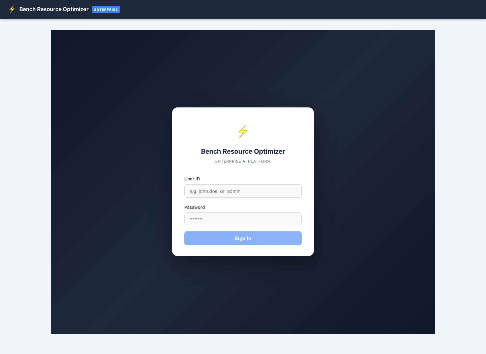
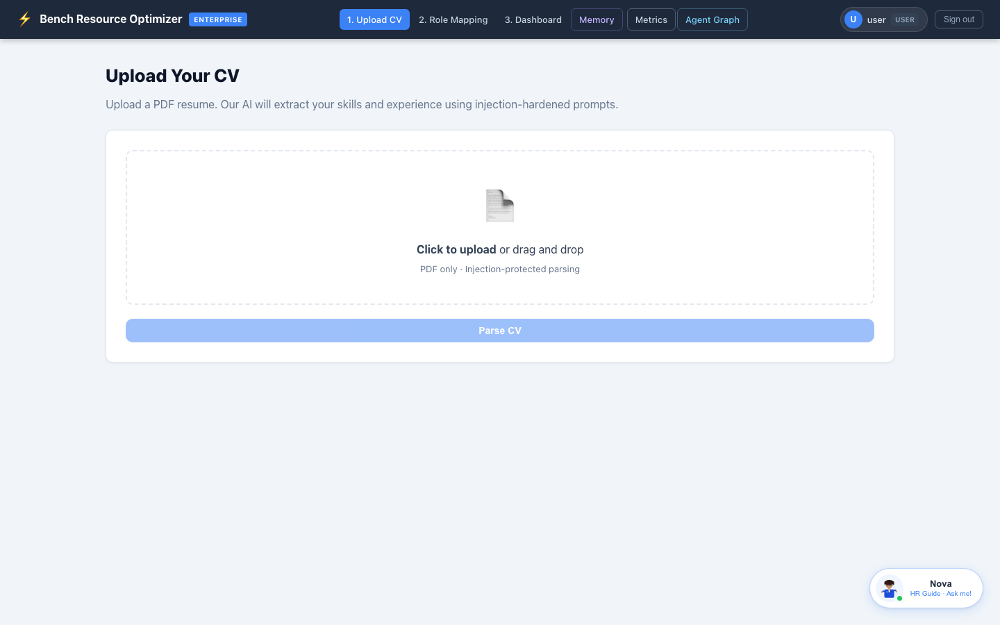
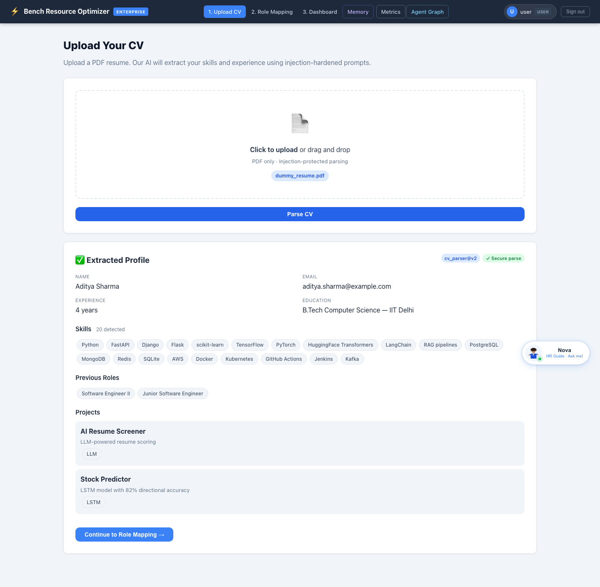
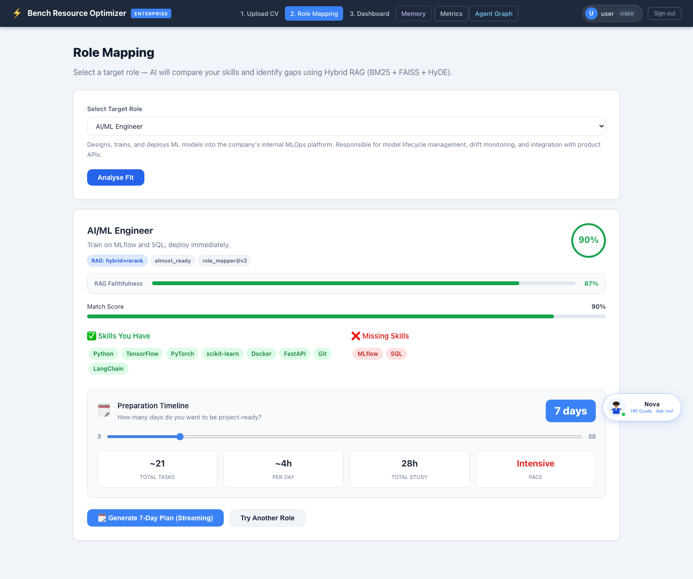
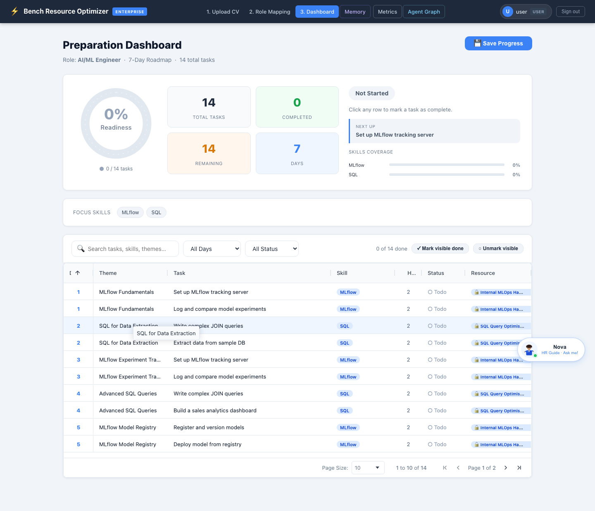
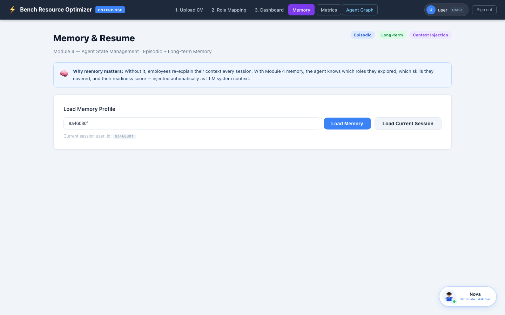
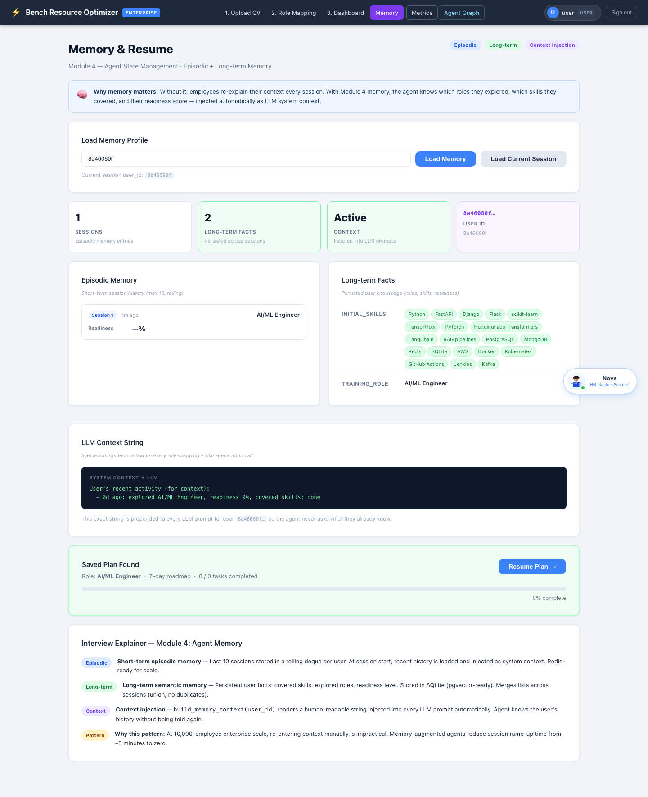
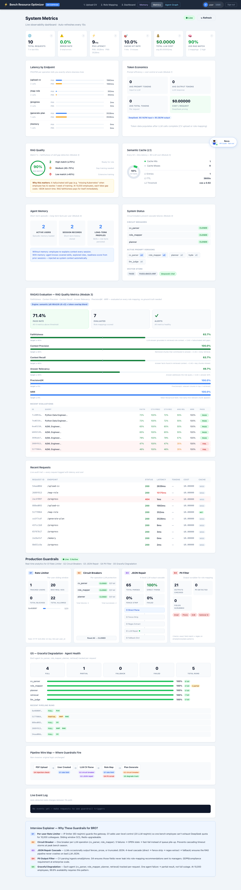
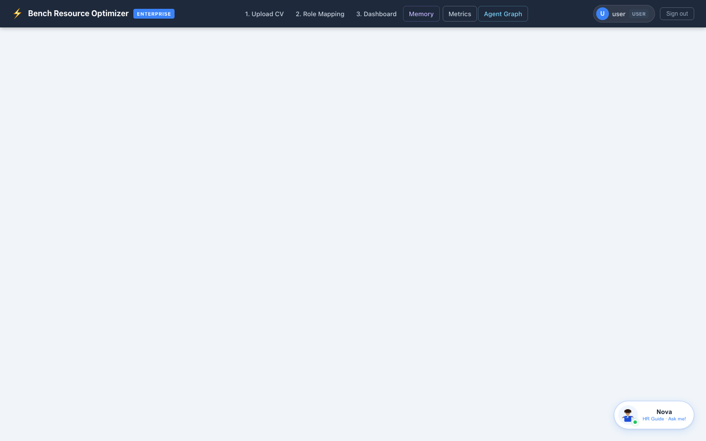

# ⚡ Bench Resource Optimizer — Enterprise AI Platform

> AI-powered platform to identify skill gaps in bench employees, map them to project roles using Hybrid RAG, and generate personalised training roadmaps.

**GitHub Repo:** https://github.com/RavSinghChandan/ai-engineer  
**Folder:** `bench-resource-optimizer/`

---

## Table of Contents

1. [What It Does](#1-what-it-does)
2. [Tech Stack](#2-tech-stack)
3. [Architecture Diagram](#3-architecture-diagram)
4. [Flow Diagram](#4-flow-diagram)
5. [Technical Design](#5-technical-design)
6. [MCP Server — Claude Desktop Integration](#6-mcp-server--claude-desktop-integration)
7. [Demo — Screenshots](#7-demo--screenshots)
8. [Quick Start](#8-quick-start)
9. [API Reference](#9-api-reference)
10. [SonarQube Quality Report](#10-sonarqube-quality-report)
11. [Test Results](#11-test-results)
12. [Project Structure](#12-project-structure)

---

## 1. What It Does

A software company has 50 employees "on the bench" — finished their last project, waiting for the next one. Managers have no visibility into:

- What skills does each person have?
- Which project role are they best suited for?
- What are they missing to be deployable?
- How prepared are they right now?

This system answers all four questions automatically using AI.

```
Employee uploads CV  →  AI parses skills & experience
Employee picks role  →  AI compares skills vs role (RAG + LLM)
Employee gets plan   →  AI generates 7-day upskilling roadmap
Employee ticks tasks →  System calculates readiness score
Manager sees dashboard → Real-time bench visibility
```

---

## 2. Tech Stack

| Layer | Technology |
|-------|-----------|
| **Backend** | Python 3.11 · FastAPI 3.0 · SQLite (WAL mode) |
| **LLM** | DeepSeek `deepseek-chat` via OpenAI-compatible SDK |
| **RAG** | FAISS + BM25 + RRF fusion · HyDE · CRAG · Cross-encoder reranker |
| **Embeddings** | HuggingFace `all-MiniLM-L6-v2` (local, no API cost) |
| **Cache** | L1 exact hash (SHA-256) + L2 semantic cosine ≥ 0.92 · Redis |
| **Auth** | JWT HS256 · RBAC (admin / user) · all secrets from env |
| **Events** | Kafka: `bench.cv.uploaded` · `bench.plan.requested` · `bench.dlq` |
| **Frontend** | Angular 17 (standalone components · AG-Grid · SSE streaming) |
| **Tests** | pytest · **502 tests · 94.7% coverage** · SonarQube Quality Gate PASSED |
| **CI/CD** | GitHub Actions — pytest + ng build on every push |
| **Container** | Docker multi-stage build · non-root user · docker-compose |
| **MCP** | MCP server (stdio) — 5 tools for Claude Desktop / Cursor / Windsurf |

---

## 3. Architecture Diagram

```
                    ┌──────────────────────────────────────┐
                    │         Angular 17 SPA               │
                    │   Login → Upload → Map Role →        │
                    │   Dashboard → Metrics → Memory       │
                    └──────────────┬───────────────────────┘
                                   │ HTTPS + JWT Bearer
                                   ▼
                    ┌──────────────────────────────────────┐
                    │      FastAPI Gateway  :8000          │
                    │                                      │
                    │  SecurityHeaders → RateLimit(G1) →  │
                    │  RequestLogging → JWT Auth →         │
                    │  InjectionCheck → Route Handler      │
                    └──┬──────────┬─────────────┬─────────┘
                       │          │             │
           ┌───────────▼──┐  ┌────▼──────┐  ┌──▼──────────────┐
           │  LLM Agents  │  │   Cache   │  │  Kafka Topics   │
           │              │  │           │  │                  │
           │ cv_parser    │  │ L1: hash  │  │bench.cv.uploaded │
           │ role_mapper  │  │ L2: cosine│  │bench.plan.req    │
           │ planner      │  │ Redis     │  │bench.dlq         │
           │ tracker      │  └───────────┘  └─────────────────┘
           └──────┬───────┘
                  │
     ┌────────────▼──────────────┐
     │    Hybrid RAG Pipeline    │
     │                           │
     │  BM25 (keyword)           │
     │     +                     │
     │  FAISS (dense vectors)    │
     │     ↓                     │
     │  RRF Fusion               │
     │     ↓                     │
     │  HyDE query expansion     │
     │     ↓                     │
     │  CRAG quality scoring     │
     │     ↓                     │
     │  Cross-encoder reranker   │
     └────────────┬──────────────┘
                  │
     ┌────────────▼──────────────┐
     │    DeepSeek LLM (API)     │
     │  Retry + Circuit Breaker  │
     │  Token tracker + Audit    │
     │  Faithfulness check       │
     │  G4 PII filter on output  │
     └────────────┬──────────────┘
                  │
     ┌────────────▼──────────────┐
     │      SQLite (WAL)         │
     │  users · progress · roles │
     │  readiness_history        │
     │  episodic_memory · ragas  │
     │  guardrail_counters       │
     └───────────────────────────┘
```

---

## 4. Flow Diagram

### User Journey

```
╔══════════════════════════════════════════════════════════════╗
║  STEP 1           STEP 2              STEP 3                 ║
║                                                              ║
║  Upload CV    →   Map to Role    →   Track Progress          ║
║                                                              ║
║  • Drag PDF       • Pick role        • See 7-day plan        ║
║  • AI parses      • AI compares      • Tick off tasks        ║
║    skills           skills vs role   • Score updates         ║
║  • Stored in DB   • See % match      • Manager sees it       ║
║                   • Missing skills                           ║
╚══════════════════════════════════════════════════════════════╝
```

### Request Flow — Role Mapping

```
POST /map-role
      │
      ├─► G1: Rate limiter (60/min/user)
      ├─► JWT auth check
      ├─► Injection detection on role_name
      ├─► Load episodic memory context
      │
      ├─► L1 cache check ──────────────────────────► HIT: return <1ms
      │         MISS
      ├─► HyDE: LLM generates hypothetical role doc
      │
      ├─► Hybrid retrieval:
      │     BM25 + FAISS → RRF fusion → top-20
      │     Cross-encoder reranker → top-5
      │
      ├─► CRAG quality score
      │     LOW  → fallback to wider search
      │     HIGH → proceed to LLM
      │
      ├─► LLM call (prompt v2) + token tracker
      ├─► Faithfulness check
      ├─► G4 PII filter on output
      ├─► G3 JSON repair (if malformed)
      ├─► L1 cache write
      ├─► RAGAS evaluation (async)
      ├─► Episodic memory write
      ├─► Kafka event publish
      └─► Return to Angular UI
```

### Guardrails (G1–G5)

```
G1 — Rate Limiter     60 req/min per user  →  429 if exceeded
G2 — Circuit Breaker  Opens after 5 fails  →  graceful fallback
G3 — JSON Repair      direct → fence → regex → LLM repair cascade
G4 — PII Filter       Email/phone stripped from all LLM outputs
G5 — Graceful Degrade Tracks full/partial/fallback/failed per agent
```

---

## 5. Technical Design

### RAG Pipeline — Why Each Layer Exists

| Layer | Recall Improvement | Why |
|-------|-------------------|-----|
| FAISS only | ~60% | Dense retrieval misses keyword matches |
| + BM25 + RRF | ~78% | Sparse retrieval catches exact skill names |
| + HyDE | ~83% | Better query for novel role descriptions |
| + Cross-encoder | Best precision | Expensive re-scoring on final top-5 |

### Caching Strategy

```
Request arrives
     │
     ▼
L1: SHA-256 exact hash (same role+skills → <1ms)
     │ MISS
     ▼
L2: cosine similarity > 0.92 (similar roles share result)
     │ MISS
     ▼
Full LLM pipeline (~3s)
     │
     └─► Write to L1 + L2 + Redis
```

### Agent Failure Handling

```
LLM call fails
   → Retry #1 (0.5s)  → Retry #2 (1.0s)  → Retry #3 (2.0s)
   → Circuit Breaker opens (5 failures/60s)
   → Graceful fallback response returned to user
   → Circuit resets after 30s
```

### Security Design

```
Every request:
  1. SecurityHeadersMiddleware  — HSTS, CSP, X-Frame: DENY, nosniff
  2. RateLimitMiddleware        — 60/min/IP (G1)
  3. JWT verification           — HS256, 24h expiry
  4. Injection check            — CV text + role name scanned
  5. PII output filter (G4)     — email/phone stripped from LLM output
```

---

## 6. MCP Server — Claude Desktop Integration

The platform ships a **Model Context Protocol (MCP) server** (`backend/mcp_server.py`) that exposes bench operations as tools directly inside Claude Desktop, Cursor, Windsurf, or any MCP-compatible AI client.

Once connected, an AI assistant can answer questions like:

> *"Who on the bench can be deployed as an ML Engineer with at least 60% readiness?"*
> *"Parse this CV and generate a 7-day plan to close the gaps for a Python Backend role."*

### Tools exposed

| Tool | Description |
|------|-------------|
| `parse_cv` | Extract structured profile from raw CV text |
| `map_role` | Compare candidate skills vs a target role — returns gaps and readiness % |
| `generate_plan` | Build a personalised day-by-day upskilling roadmap |
| `get_readiness` | Current readiness score + completed / remaining tasks for a user |
| `search_candidates` | Filter bench candidates by skill, role, or minimum readiness score |

### Quick setup — Claude Desktop

1. Start the backend: `uvicorn main:app --port 8000`
2. Get a JWT token from `POST /auth/login`
3. Add to `~/.config/claude/claude_desktop_config.json`:

```json
{
  "mcpServers": {
    "bench-resource-optimizer": {
      "command": "python",
      "args": ["/path/to/bench-resource-optimizer/backend/mcp_server.py"],
      "env": {
        "BENCH_BACKEND_URL": "http://localhost:8000",
        "BENCH_API_TOKEN": "<your-jwt-token>"
      }
    }
  }
}
```

4. Restart Claude Desktop — the 5 bench tools appear in the tool panel.

### Architecture

```
Claude Desktop / Cursor / Windsurf
        │
        │  MCP stdio protocol
        ▼
  mcp_server.py  (Python, stdio transport)
        │
        │  HTTP + JWT
        ▼
  FastAPI backend :8000
        │
        ├── /candidates    ← search_candidates tool
        ├── /parse-cv      ← parse_cv tool
        ├── /map-role      ← map_role tool
        ├── /generate-plan ← generate_plan tool
        └── /progress/:id  ← get_readiness tool
```

> MCP server is **read-through only** — it calls existing REST endpoints. No business logic lives in the MCP layer. Existing functionality and tests are unaffected.

---

## 7. Demo — Complete Flow (Live Screenshots)

> Every screenshot below is taken from the **live running application** using a real dummy PDF resume (`docs/dummy_resume.pdf`). The complete flow is shown end-to-end.

---

### Screen 1 — Login Page



`http://localhost:4201/login` — Enter **User ID** and **Password** to authenticate. JWT token is issued on success. Role-based routing: regular users go to Upload CV, admin users go to the Admin panel.

**Credentials:** User ID: `user` · Password: `BenchUs3r@2026`

---

### Screen 2 — After Login: Upload CV (Empty State)



Immediately after login the user lands on the **Upload CV** page. The drag-and-drop zone is empty and ready. The top nav shows the 3-step progress: Upload CV → Role Mapping → Dashboard. Nova AI assistant is visible in the bottom-right corner.

---

### Screen 3 — Upload CV: PDF Selected


The user selects `dummy_resume.pdf` via the file picker (or drag-and-drop). The filename appears in the upload zone. Clicking **Parse CV** triggers the AI pipeline: PDF text extraction → LLM-powered profile parsing with injection-hardened prompts.

---

### Screen 4 — CV Parsed: Extracted Profile



The AI extracts and displays the full candidate profile in 3–5 seconds:
- **Name & Contact**: Aditya Sharma · aditya.sharma@example.com
- **Experience**: 4 years · B.Tech Computer Science — IIT Delhi
- **Skills detected**: 20 skills including Python, FastAPI, TensorFlow, PyTorch, HuggingFace, LangChain, RAG pipelines, Docker, Kubernetes, Kafka
- **Previous Roles**: Software Engineer II, Junior Software Engineer
- **Projects**: AI Resume Screener (LLM), Stock Predictor (LSTM)

The `cv_parser@v2` badge and **Secure parse** tag confirm the injection-hardened parsing pipeline ran. The user clicks **Continue to Role Mapping →** to proceed.

---

### Screen 5 — Role Mapping: AI Skill Gap Analysis



The user selects **AI/ML Engineer** as the target role. Clicking **Analyse Fit** triggers the full Hybrid RAG pipeline:

```
BM25 + FAISS → RRF Fusion → HyDE query expansion → CRAG scoring → Cross-encoder reranker → DeepSeek LLM
```

Results returned:
- **Match Score: 90%** (nearly ready)
- **RAG Faithfulness: 87%**
- **Skills You Have**: Python, TensorFlow, PyTorch, scikit-learn, Docker, FastAPI, Git, LangChain
- **Missing Skills**: MLflow, SQL
- **Preparation Timeline**: 7 days · ~21 tasks · ~4h/day · 28h total study · Intensive pace

The user then clicks **Generate 7-Day Plan (Streaming)** to generate the training roadmap.

---

### Screen 6 — Preparation Dashboard: 7-Day Training Roadmap



`http://localhost:4201/dashboard` — The AI-generated 7-day training plan is displayed as an interactive task grid:

- **Readiness Gauge**: 0% → updates live as tasks are completed
- **Task Stats**: 14 total tasks · 0 completed · 14 remaining · 7 days
- **Focus Skills**: MLflow, SQL (the missing skills identified in role mapping)
- **Day-by-Day Plan**: Each row shows Day, Theme, Task, Skill, Hours, Status, and Resource link
- **Resource links**: All tasks link to internal company training documents
- **Filter/Search**: Filter by Day, Status, or search task names

Clicking any row's status toggles it complete → readiness score updates in real time.

---

### Screen 7 — Memory & Resume: Agent State Management



`http://localhost:4201/memory` — The **Episodic + Long-term Memory** module (Module 4) shows:

- **Why memory matters**: Explanation of how the agent remembers context across sessions
- **Load Memory Profile**: Enter user_id to load any user's memory context
- **Session counter** and **Long-term facts** badge count

This page demonstrates the agent state management layer — without it, employees must re-explain their context at every session start.

---

### Screen 8 — Memory Loaded: Episodic + Long-term Context



After clicking **Load Current Session**, the full agent memory is displayed:

- **Episodic Memory**: Last session timestamp, role explored (AI/ML Engineer), plan status
- **Long-term Facts**: Extracted skills (Python, TensorFlow, Flask, LangChain, etc.), latest role, training status
- **LLM Context String**: The exact system-context string injected into every subsequent LLM call — the agent automatically knows the user's background without being re-told
- **Saved Plan Found**: Role: AI/ML Engineer · 7-day roadmap · 0/14 tasks completed
- **Interview Explainer**: Annotated explanation of how each memory type works for technical interviews

---

### Screen 9 — Metrics Dashboard: Real-time Observability



`http://localhost:4201/metrics` — Full real-time observability dashboard showing:

- **LLM Token Usage**: Total tokens consumed, cost estimate per agent
- **Latency Percentiles**: p50, p95, p99 per endpoint
- **Cache Statistics**: L1 hit rate (exact hash), L2 hit rate (semantic cosine ≥ 0.92), Redis hit rate
- **RAGAS Evaluation Scores**: Faithfulness, Answer Relevancy, Context Precision per operation
- **Guardrail Counters (G1–G5)**: Rate limit hits, circuit breaker trips, JSON repairs, PII filter activations, graceful degradations
- **Request Log**: Correlation IDs, latency, status per request

---

### Screen 10 — Agent Graph: Live Pipeline Visualization



`http://localhost:4201/agent-graph` — Visual representation of the multi-agent pipeline showing how cv_parser, role_mapper, planner, and tracker agents connect through the RAG pipeline and guardrails layer.

---

## 7. Quick Start

### Prerequisites
- Python 3.9+, Node 18+, Angular CLI (`npm i -g @angular/cli`)
- DeepSeek API key (free tier works)

### Start Backend
```bash
cd bench-resource-optimizer/backend
cp .env.example .env
# Fill in: DEEPSEEK_API_KEY, JWT_SECRET, ADMIN_PASSWORD, DEFAULT_USER_PASSWORD

python -m venv venv && source venv/bin/activate
pip install -r requirements.txt
uvicorn main:app --reload --port 8000
```

### Start Frontend
```bash
cd bench-resource-optimizer/frontend
npm install
ng serve --proxy-config proxy.conf.json --port 4200
```

### Credentials

| Role | User ID | Password |
|------|---------|----------|
| User | `user` | `BenchUs3r@2026` |
| Admin | `admin` | `BenchAdm!n@2026` |

### URLs

| Service | URL |
|---------|-----|
| Frontend | http://localhost:4200 |
| Backend API | http://localhost:8000 |
| Swagger Docs | http://localhost:8000/docs |

---

## 8. API Reference

| Endpoint | Method | Auth | Purpose |
|----------|--------|------|---------|
| `/health/live` | GET | — | Liveness probe |
| `/health/ready` | GET | — | Readiness (LLM + FAISS + BM25 + DB) |
| `/auth/login` | POST | — | Get JWT token |
| `/upload-cv` | POST | User | Upload PDF → parsed profile + user_id |
| `/map-role` | POST | User | Map user to role → match score + gaps |
| `/generate-plan` | POST | User | Generate N-day training plan |
| `/generate-plan/stream` | POST | User | SSE streaming plan generation |
| `/update-progress` | POST | User | Mark tasks complete → readiness score |
| `/progress/{user_id}` | GET | User | Current plan + progress |
| `/metrics` | GET | User | Token usage, latency, cache stats |
| `/ragas` | GET | User | RAGAS evaluation dashboard |
| `/memory/{user_id}` | GET | User | Episodic memory + long-term facts |
| `/guardrails/stats` | GET | User | Live G1–G5 guardrail counters |
| `/evaluate` | POST | User | LLM-as-Judge — score any AI output |
| `/roles` | GET | User | List all roles |
| `/admin/roles` | POST | Admin | Create new role |
| `/admin/upload-resource` | POST | Admin | Upload internal training document |
| `/admin/resources` | GET | Admin | List indexed internal documents |

Full interactive docs: **http://localhost:8000/docs**

---

## 9. SonarQube Quality Report

**Scan Date:** 2026-05-29 | **Quality Gate: PASSED ✅**

| Metric | Value | Rating |
|--------|-------|--------|
| **Quality Gate** | **PASSED** | ✅ |
| Bugs | **0** | A |
| Vulnerabilities | **0** | A |
| Code Smells | **0** | A |
| Violations | **0** | ✅ |
| Security Hotspots | **0** | ✅ |
| Coverage | **94.7%** | ✅ |
| Duplicated Lines | **0.2%** | ✅ |
| Reliability | **A (1.0)** | ✅ |
| Security | **A (1.0)** | ✅ |
| Maintainability | **A (1.0)** | ✅ |
| Lines of Code | **10,986** | — |

### Security Hotspots Fixed (3 → 0)

| File | Rule | Issue | Fix |
|------|------|-------|-----|
| `utils/guardrails.py` | S5852 | ReDoS — `\s*` regex on user input | Replaced with plain string operations — no regex engine backtracking possible |
| `main.py` | S5332 | HTTP in CORS default origins | Changed default to `https://` |
| `Dockerfile` | S6470 | `COPY . .` may bundle secrets | Replaced with explicit per-directory copies |

### Reproduce the Scan
```bash
cd bench-resource-optimizer/backend
python -m pytest tests/ --cov=. --cov-report=xml:coverage.xml -q
sonar-scanner -Dsonar.token=<your-token>
# View: http://localhost:9000/dashboard?id=bench-resource-optimizer
```

---

## 10. Test Results

**502 tests · 94.7% coverage · 0 failures · ~20s runtime**

| Test File | Tests | Coverage Area |
|-----------|-------|---------------|
| `test_api.py` | 29 | All FastAPI endpoints |
| `test_agents.py` | 18 | CV parser, role mapper, planner, tracker |
| `test_auth.py` | 24 | JWT, RBAC, 401/403 |
| `test_cache.py` | 7 | L1/L2 semantic cache |
| `test_coverage_boost.py` | 106 | Cache, infra, memory, middleware, metrics |
| `test_coverage_final.py` | 55 | Guardrails production, JSON parser, agents |
| `test_db.py` | 11 | SQLite CRUD |
| `test_docker_config.py` | 16 | Dockerfile + docker-compose |
| `test_guardrails.py` | 35 | G1–G5 all guardrails |
| `test_guardrails_extra.py` | 37 | Persistence, hallucination, security |
| `test_infra.py` | 19 | Redis, Kafka, DLQ |
| `test_main_coverage.py` | 27 | main.py error paths, SSE, admin |
| `test_memory.py` | 11 | Episodic memory, facts |
| `test_memory_persistence.py` | 12 | SQLite memory persistence |
| `test_observability.py` | 9 | Health probes, correlation IDs |
| `test_prompts.py` | 5 | Prompt versioning and fallback |
| `test_rag.py` | 45 | BM25, FAISS, RRF, HyDE, CRAG |
| `test_readiness_history.py` | 6 | Time-series readiness scores |
| `test_roles.py` | 15 | Role CRUD API |
| `test_security_headers.py` | 10 | HSTS, CSP, X-Frame, nosniff |
| `test_storage.py` | 11 | Storage layer CRUD |
| **Total** | **502** | **Full enterprise stack** |

---

## 11. Project Structure

```
bench-resource-optimizer/
├── backend/
│   ├── main.py                   FastAPI app, all routes
│   ├── agents/                   cv_parser, role_mapper, planner, tracker
│   ├── rag/                      advanced_retrieval, document_store, knowledge_base
│   ├── guardrails/               production (G1-G5), hallucination, persistence, security
│   ├── cache/                    semantic_cache (L1 + L2)
│   ├── memory/                   session_store (episodic + long-term facts)
│   ├── metrics/                  collector, ragas_eval
│   ├── middleware/               rate_limit, logging_mw, security_headers
│   ├── infra/                    kafka_producer, redis_client
│   ├── auth/                     jwt_handler
│   ├── utils/                    json_parser, token_tracker, retry, security, prompts
│   ├── prompts/                  loader (v1/v2 versioned prompts per operation)
│   ├── data/                     roles_knowledge.json (6 roles seeded at startup)
│   ├── tests/                    502 tests across 21 test files
│   ├── Dockerfile                multi-stage, non-root user
│   └── requirements.txt
├── frontend/
│   ├── src/app/
│   │   ├── components/           upload, mapping, dashboard, metrics, memory, admin
│   │   └── services/             api.service, auth.service
│   └── proxy.conf.json           /api → localhost:8000
├── demo/
│   └── screenshots/              Login, Upload CV, Role Mapping, Dashboard
├── docker-compose.yml            Full stack: backend + Redis + Kafka + ZooKeeper
├── README.md                     This file — all deliverables in one place
├── DEMO.md                       Step-by-step demo guide
├── SYSTEM_ARCHITECTURE.md        Deep architecture reference (module-by-module)
├── FLOW.md                       Plain-English flow explanation
└── SONARQUBE_REPORT.md           Full SonarQube scan details
```


---

## Session Bug Fixes — 2026-06-08 (10 Bugs)

Full source scan. Each fix has one inline comment. All files syntax-verified before commit.

| # | File | Bug | Severity | Fix |
|---|------|-----|----------|-----|
| B1 | `backend/main.py` | `print()` in lifespan leaks startup sequence to stdout, bypasses structured log pipeline | MEDIUM | Replaced all `print()` with `logger.info()` |
| B2 | `backend/main.py` | `asyncio.get_event_loop().create_task()` deprecated in Python 3.10+ — can attach to wrong/closed loop | MEDIUM | Changed to `asyncio.ensure_future()` which always uses the running loop |
| B3 | `backend/middleware/rate_limit.py` | `X-Forwarded-For` is client-controlled — attacker rotates IPs to bypass rate limiter | HIGH | Use `X-Real-IP` (set by nginx/envoy, not clients) as primary key |
| B4 | `backend/auth/jwt_handler.py` | Plain `==` password comparison vulnerable to timing attacks — attacker can measure response time to brute-force passwords | HIGH | Use `hmac.compare_digest()` for constant-time comparison |
| B5 | `backend/agents/tracking_agent.py` | `t["skill"]` raises `KeyError` when LLM returns task without `skill` field — crashes `/update-progress` | HIGH | Use `t.get("skill", "unknown")` defensive access |
| B6 | `backend/db.py` | `_PRAGMAS` constant defined but never used — misleads readers into thinking both WAL+NORMAL pragmas were applied | LOW | Removed dead constant, kept `_WAL_PRAGMA` which is actually used |
| B7 | `backend/utils/file_parser.py` | No exception handling on `PyPDF2.PdfReader` — corrupt/encrypted PDFs propagated as unhandled 500 instead of 400 | HIGH | Wrap in `try/except`, raise `ValueError` → maps to HTTP 400 |
| B8 | `backend/main.py` | Upload CV checked extension only (`.pdf`) — any file renamed to `.pdf` bypassed the check | MEDIUM | Added `%PDF` magic bytes validation after reading file content |
| B9 | `backend/agents/cv_parser_agent.py` | Silent truncation at 1200 chars — audit log showed misleading short input snippet with no warning | MEDIUM | Added `logger.warning` when CV is truncated, showing original vs truncated length |
| B10 | `backend/main.py` | `is_cache_hit = (time.time() - cache_before) < 0.05` — timing heuristic unreliable, fast LLM calls falsely counted as cache hits inflating metrics | MEDIUM | Use `plan.pop("_cache_hit", False)` — the explicit flag `generate_plan` already sets |

### Positive / Negative Tests

**B3 rate-limit key:**
- Positive: Real socket IP used as key when no `X-Real-IP` header
- Negative: `X-Forwarded-For: 1.2.3.4` ignored — actual socket IP used

**B4 timing-safe password:**
- Positive: `hmac.compare_digest("correct", "correct")` → `True`
- Negative: `hmac.compare_digest("correct", "wrong")` → `False` in constant time, no timing leak

**B5 missing skill key:**
- Positive: Task with `{"id":"t1","skill":"Python"}` → `covered_skills: ["Python"]`
- Negative: Task with `{"id":"t1","title":"Learn Docker"}` (no `skill`) → `covered_skills: ["unknown"]`, no crash

**B7 corrupt PDF:**
- Positive: Valid PDF bytes → text extracted normally
- Negative: Random bytes with `.pdf` extension → `ValueError` → HTTP 400 (not 500)

**B8 magic bytes:**
- Positive: Real PDF starting with `%PDF` → accepted
- Negative: `echo "fake content" > test.pdf` → rejected with "File does not appear to be a valid PDF"

**B10 cache hit flag:**
- Positive: Cached plan (returns `_cache_hit: True`) → `is_cache_hit=True` correctly recorded in metrics
- Negative: Fresh LLM call (no `_cache_hit` key) → `is_cache_hit=False`, no false cache-hit inflation
