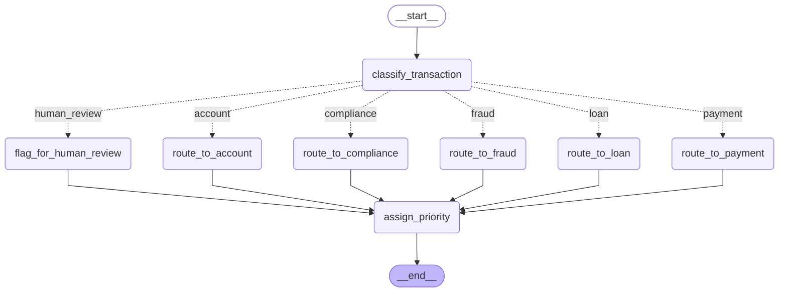
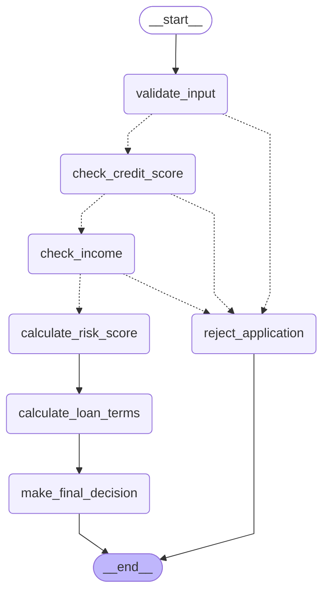
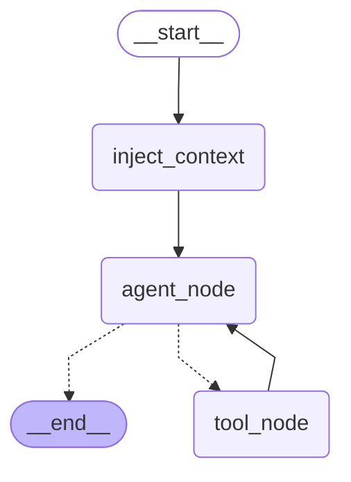
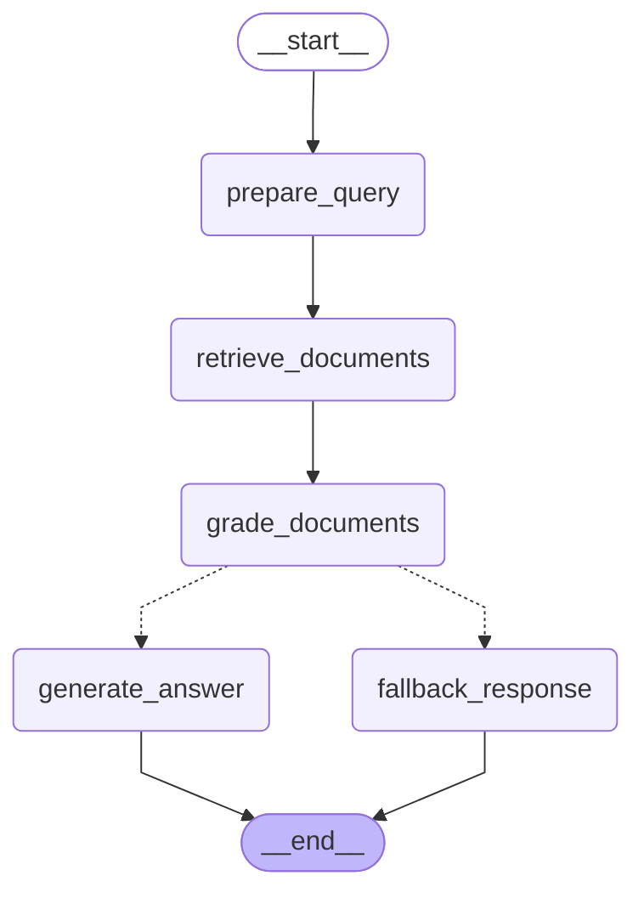
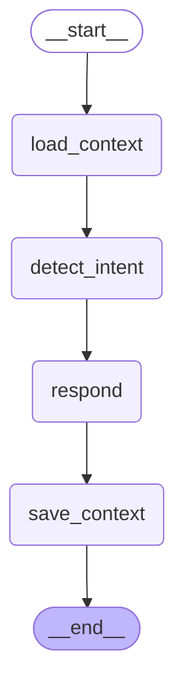
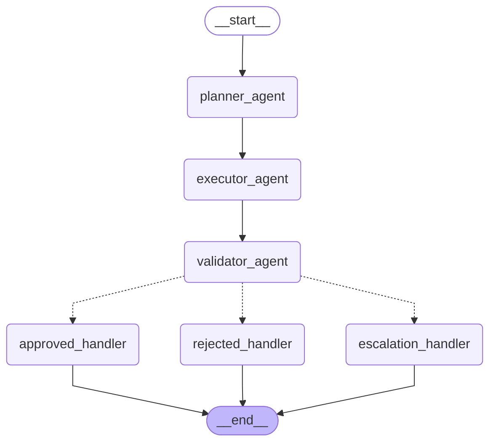
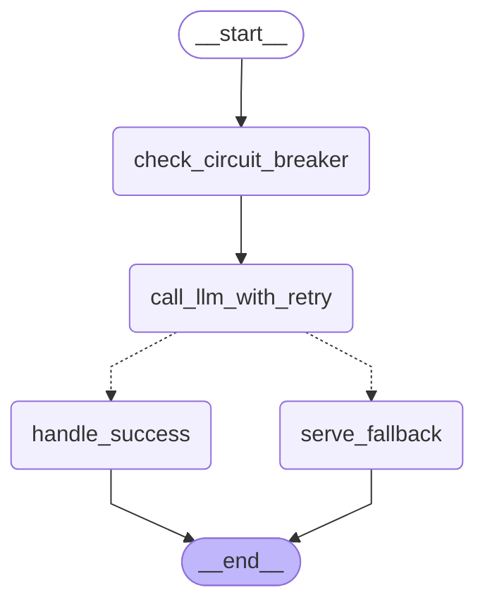

# Banking AI Platform — Graph Architecture

Auto-generated from compiled LangGraph objects. Diagrams reflect the **actual** node/edge structure, not documentation.

---

## Step 2 — Transaction Routing Graph

**File:** `app/graphs/transaction_router.py`
**Endpoint:** `POST /api/v1/transactions/route`

### What it does
Receives a transaction, classifies it, dispatches to the correct engine via a conditional edge, then assigns priority. All routing nodes converge before priority assignment — fan-out / fan-in pattern.

### ASCII Diagram (generated by LangGraph)
```
                                                     +-----------+
                                                     | __start__ |
                                                     +-----------+
                                                           *
                                                           *
                                              +----------------------+
                                   ...........| classify_transaction |...........
                          .........           +----------------------+           .........
                   ........      .......            ...    ...            .......         ........
             .......           ....                .         .           ....                    ........
+-----------------------+  +------------------+  +---------------------+  +----------------+  +---------------+  +------------------+
| flag_for_human_review |  | route_to_account |  | route_to_compliance |  | route_to_fraud |  | route_to_loan |  | route_to_payment |
+-----------------------+  +------------------+  +---------------------+  +----------------+  +---------------+  +------------------+
              ***                  ***                    ***                    ***                ***                   ***
                 ***********************************************  ***************************************** ****************
                                                         +-----------------+
                                                         | assign_priority |
                                                         +-----------------+
                                                                  *
                                                             +---------+
                                                             | __end__ |
                                                             +---------+
```

### Mermaid Diagram


### Node responsibilities
| Node | Type | Description |
|---|---|---|
| `classify_transaction` | Entry | Validates and normalises transaction type |
| `route_to_payment` | Routing | Sets decision = `payment_processor` |
| `route_to_loan` | Routing | Sets decision = `loan_engine` |
| `route_to_fraud` | Routing | Sets decision = `fraud_engine`, flags for human review |
| `route_to_compliance` | Routing | Sets decision = `compliance_assistant` |
| `route_to_account` | Routing | Sets decision = `account_agent` |
| `flag_for_human_review` | Routing | Unknown type → human review queue |
| `assign_priority` | Convergence | Derives HIGH/MEDIUM/LOW from type + amount |

### Edge logic
```python
# Conditional edge on classify_transaction output
def decide_route(state) -> str:
    return {
        PAYMENT: "payment", LOAN: "loan", FRAUD_CHECK: "fraud",
        COMPLIANCE: "compliance", ACCOUNT_LOOKUP: "account",
    }.get(state["transaction_type"], "human_review")
```

---

## Step 3 — Loan Eligibility Stateful Workflow

**File:** `app/graphs/loan_eligibility.py`
**Endpoint:** `POST /api/v1/loans/eligibility`

### What it does
Multi-step eligibility pipeline. State accumulates across all nodes. Three independent rejection gates — validation, credit score, and income/DTI — each short-circuit directly to `reject_application` on failure, skipping all downstream compute.

### ASCII Diagram (generated by LangGraph)
```
                              +-----------+
                              | __start__ |
                              +-----------+
                                    *
                           +----------------+
                           | validate_input |....
                           +----------------+    ........
                           ..                            .........
                        ...                                       ........
              +--------------------+                                      .....
              | check_credit_score |....                                       .
              +--------------------+    ......                                 .
              ..                              .....                             .
           ...                                     ......                      .
 +--------------+                                        ...                   .
 | check_income |                                          .                   .
 +--------------+                                          .                   .
 ..             ...                                        .                   .
..                 ..                                      .                   .
+----------------------+                                   .                 ..
| calculate_risk_score |                                   .           ......
+----------------------+                              .....       ......
            *                                    .....       .....
+----------------------+                    .....       .....
| calculate_loan_terms |             +--------------------+
+----------------------+             | reject_application |
            *                        +--------------------+
+---------------------+                       *
| make_final_decision |                        *
+---------------------+                  +---------+
            *                            | __end__ |
       +---------+                       +---------+
       | __end__ |
       +---------+
```

### Mermaid Diagram


### Node responsibilities
| Node | Type | Description |
|---|---|---|
| `validate_input` | Entry | Checks required fields are valid |
| `check_credit_score` | Gate | Rejects if score < type-specific threshold |
| `check_income` | Gate | Rejects if DTI > 43% or amount > income multiple |
| `calculate_risk_score` | Compute | 0–100 score from credit, DTI, employment years |
| `calculate_loan_terms` | Compute | Risk-adjusted interest rate + term months |
| `make_final_decision` | Decision | APPROVED / PENDING_REVIEW based on risk score |
| `reject_application` | Terminal | Sets decision = REJECTED, logs reason |

### State flow
```
validate_input → check_credit_score → check_income → calculate_risk_score
                                                              ↓
                                              State now has: dti, risk_score
                                                              ↓
                                              calculate_loan_terms
                                                              ↓
                                              State now has: interest_rate, term
                                                              ↓
                                              make_final_decision  →  END
```

### Banking rules encoded
| Rule | Value |
|---|---|
| Min credit score (home) | 680 |
| Min credit score (personal) | 600 |
| Max debt-to-income ratio | 43% |
| Max loan (personal) | 1× annual income |
| Max loan (home) | 5× annual income |
| Risk score for auto-approve | ≥ 30 |

---

## Step 4 — Account Intelligence Agent (Tool-Calling)

**File:** `app/graphs/account_agent.py`
**Endpoint:** `POST /api/v1/accounts/query`

### What it does
ReAct-style agentic loop. The LLM autonomously decides which tools to call (account details, transactions, or both), executes them, and synthesises a final natural-language answer. The loop continues until the LLM produces a response with no `tool_calls`.

### ASCII Diagram (generated by LangGraph)
```
     +-----------+
     | __start__ |
     +-----------+
            *
   +----------------+
   | inject_context |
   +----------------+
            *
      +------------+
      | agent_node | ◀─────────────┐
      +------------+               │
      ...         ***              │
     .               *             │
   ..                 **           │
+---------+      +-----------+     │
| __end__ |      | tool_node |─────┘
+---------+      +-----------+
```

### Mermaid Diagram


### Node responsibilities
| Node | Type | Description |
|---|---|---|
| `inject_context` | Entry | Wraps query as `[SystemMessage, HumanMessage]` |
| `agent_node` | LLM | ChatOpenAI with tools bound — decides what to call |
| `tool_node` | Executor | Runs requested tools, appends `ToolMessage` results |

### Tools available to the agent
| Tool | Description |
|---|---|
| `get_account_details(account_id)` | Returns owner, type, status, balance, branch |
| `get_transactions(account_id, limit)` | Returns N most-recent transactions |

### Edge logic (ReAct loop)
```python
def should_use_tools(state) -> str:
    last = state["messages"][-1]
    if isinstance(last, AIMessage) and last.tool_calls:
        return "tool_node"   # loop back
    return "__end__"         # final answer ready
```

### Message flow
```
[SystemMessage]           ← banking assistant prompt
[HumanMessage]            ← "Account: ACC-1001 / What is my balance?"
[AIMessage + tool_calls]  ← LLM decides to call get_account_details
[ToolMessage]             ← {"balance": 12450.75, ...}
[AIMessage]               ← "Your current balance is $12,450.75."  ← END
```

---

## Step 5 — Compliance RAG Assistant

**File:** `app/graphs/compliance_rag.py`
**Endpoint:** `POST /api/v1/compliance/query`

### What it does
Retrieval-Augmented Generation over internal banking compliance documents (KYC, AML, PCI DSS, GDPR). Retrieves from a FAISS vector store, grades relevance to filter noise, then generates a cited policy answer. Falls back gracefully when no relevant documents are found.

### ASCII Diagram (generated by LangGraph)
```
            +-----------+
            | __start__ |
            +-----------+
                  *
          +---------------+
          | prepare_query |
          +---------------+
                  *
       +--------------------+
       | retrieve_documents |
       +--------------------+
                  *
        +-----------------+
        | grade_documents |
        +-----------------+
         ...             ...
       ..                   ..
+-------------------+   +-----------------+
| fallback_response |   | generate_answer |
+-------------------+   +-----------------+
         ***             ***
            **         **
              **     **
            +---------+
            | __end__ |
            +---------+
```

### Mermaid Diagram


### Node responsibilities
| Node | Type | Description |
|---|---|---|
| `prepare_query` | Entry | Normalises query text, extracts category hint |
| `retrieve_documents` | Retrieval | FAISS `similarity_search_with_score`, optional category filter |
| `grade_documents` | Filter | Drops chunks with L2 distance > 0.8; keeps top-2 as fallback |
| `generate_answer` | LLM | Builds numbered context block, calls ChatOpenAI with citations |
| `fallback_response` | Terminal | Returns safe "contact compliance team" message |

### Edge logic
```python
def route_after_grading(state) -> str:
    if state.get("graded_docs"):
        return "generate_answer"
    return "fallback_response"
```

### Documents loaded into FAISS
| File | Category | Contents |
|---|---|---|
| `kyc_policy.txt` | kyc | CIP, EDD, sanctions screening, record-keeping |
| `aml_policy.txt` | aml | SAR/CTR thresholds, red flags, Travel Rule |
| `pci_dss_policy.txt` | pci_dss | Encryption, access control, breach reporting |
| `gdpr_policy.txt` | gdpr | Data subject rights, retention periods, DPA notification |

### RAG pipeline details
```
TextLoader → RecursiveCharacterTextSplitter (500 / 80 overlap)
    → OpenAIEmbeddings (text-embedding-3-small)  [FakeEmbeddings in dev]
    → FAISS.from_documents()
    → similarity_search_with_score(query, k=8) → grade → top-k used
```

---

## Step 6 — Conversational Banking Assistant with Memory

**File:** `app/graphs/conversation_agent.py`
**Endpoint:** `POST /api/v1/conversation/chat`

### What it does
Multi-turn banking assistant with two memory layers. **Short-term memory**: LangGraph `MemorySaver` checkpoints the full message list per `session_id` (thread_id) — the LLM receives complete conversation history on every turn automatically. **Long-term memory**: an in-process profile store per `account_id` persists the customer's last topics across sessions.

### ASCII Diagram (generated by LangGraph)
```
  +-----------+
  | __start__ |
  +-----------+
        *
+--------------+
| load_context |   ← injects SystemMessage with profile on turn 1 only
+--------------+
        *
+---------------+
| detect_intent |  ← keyword classifier (no LLM cost)
+---------------+
        *
   +---------+
   | respond |     ← LLM with FULL history via MemorySaver
   +---------+
        *
+--------------+
| save_context |   ← appends intent to long-term profile
+--------------+
        *
   +---------+
   | __end__ |
   +---------+
```

### Mermaid Diagram


### Node responsibilities
| Node | Type | Description |
|---|---|---|
| `load_context` | Entry | Injects `SystemMessage` with customer profile on turn 1; no-op on subsequent turns |
| `detect_intent` | Classifier | Keyword match across 7 banking intents — zero LLM cost |
| `respond` | LLM | `ChatOpenAI` receives full checkpoint history; temperature 0.3 for natural tone |
| `save_context` | Persistence | Appends detected intent to long-term `account_id` profile (capped at 10 topics) |

### Memory architecture
```
Short-term (per session)           Long-term (per account)
─────────────────────────          ────────────────────────
MemorySaver (in-process)           In-process dict
  key: thread_id = session_id        key: account_id
  value: full message list           value: {name, last_topics[10]}

  LangGraph replays checkpoint       Survives session restarts
  on every invoke() call             Injected as SystemMessage context
  → LLM sees complete history        on new sessions
```

### Multi-turn example
```
Turn 1: "What are the KYC requirements?"
  → load_context injects SystemMessage (first turn)
  → detect_intent → "compliance"
  → respond → answers from training knowledge
  → save_context → profile["last_topics"] = ["compliance"]

Turn 2: "And what about the AML rules?"   (same session_id)
  → load_context → no-op (system msg already in checkpoint)
  → MemorySaver replays [SystemMsg, HumanMsg1, AIMsg1, HumanMsg2]
  → respond → LLM sees full history, answers in context of Turn 1
  → save_context → profile["last_topics"] = ["compliance", "compliance"]

Turn 3 (new session, same account_id):
  → load_context → SystemMessage now includes "Previous topics: compliance"
```

### Intents detected
`balance` · `transaction` · `loan` · `compliance` · `account` · `fraud` · `general`

---

## Step 7 — Multi-Agent Loan Approval Committee

**File:** `app/graphs/loan_committee.py`
**Agents:** `app/agents/planner.py` · `app/agents/executor.py` · `app/agents/validator.py`
**Endpoint:** `POST /api/v1/committee/evaluate`

### What it does
Three specialised agents process a loan application in a pipeline. Each agent reads the full shared state and writes only its own fields. The Validator issues the final binding verdict — APPROVED, REJECTED, or ESCALATED — after cross-checking both prior agents' findings.

### ASCII Diagram (generated by LangGraph)
```
                      +-----------+
                      | __start__ |
                      +-----------+
                            *
                    +---------------+
                    | planner_agent |    ← identifies risks, builds evaluation plan
                    +---------------+
                            *
                   +----------------+
                   | executor_agent |   ← runs all checks, computes DTI/risk/rate
                   +----------------+
                            *
                  +-----------------+
                  | validator_agent |   ← cross-checks, assigns verdict
               ...+-----------------+.....
          .....             .             .....
    ......                  .                  ......
+------------------+  +--------------------+  +------------------+
| approved_handler |  | escalation_handler |  | rejected_handler |
+------------------+  +--------------------+  +------------------+
          ***                   *                    ***
               ******           *           ******
                     *****      *      *****
                          +---------+
                          | __end__ |
                          +---------+
```

### Mermaid Diagram


### Agent responsibilities
| Agent | Role | Output fields |
|---|---|---|
| `planner_agent` | Risk assessment & plan | `evaluation_plan`, `risk_factors`, `required_checks` |
| `executor_agent` | Eligibility checks & scoring | `eligibility_passed`, `dti_ratio`, `risk_score`, `interest_rate` |
| `validator_agent` | Cross-check & final verdict | `final_verdict`, `risk_level`, `validator_confidence`, `conditions` |

### State shared across all agents
```
LoanCommitteeState (TypedDict)
    application inputs → written at entry
    planner outputs    → written by planner_agent
    executor outputs   → written by executor_agent
    validator outputs  → written by validator_agent
    agent_messages     → appended by every agent (audit trail)
```

### Verdict routing logic
```python
def route_verdict(state) -> str:
    verdict = state.get("final_verdict")
    if verdict == APPROVED:     return "approved_handler"
    if verdict == REJECTED:     return "rejected_handler"
    return "escalation_handler"    # ESCALATED
```

### Escalation triggers
- Risk score < 35 AND requested amount > $50,000
- 3+ Planner risk factors with borderline eligibility
- Inconsistency between Planner and Executor findings

### Test results (4/4 correct verdicts)
| Application | Verdict | Risk | Confidence |
|---|---|---|---|
| Strong personal (score 750) | APPROVED | low | 99% |
| Low credit home (score 620) | REJECTED | medium | 97% |
| Large business + high DTI | REJECTED | critical | 97% |
| High DTI personal | REJECTED | high | 97% |

---

## Step 8 — Resilience Layer

**Files:** `app/resilience/` · `app/graphs/resilient_agent.py`
**Endpoints:** `POST /api/v1/resilience/query` · `GET /api/v1/resilience/status` · `POST /api/v1/resilience/circuit/{name}`

### What it does
Adds four composable resilience patterns to every LLM call in the platform. The patterns layer from outermost to innermost: circuit breaker → retry → fallback chain → timeout.

### ASCII Diagram (generated by LangGraph)
```
        +-----------+
        | __start__ |
        +-----------+
               *
  +-----------------------+
  | check_circuit_breaker |  ← fast-path: reads CB state, no I/O
  +-----------------------+
               *
   +---------------------+
   | call_llm_with_retry |   ← retry(3) + fallback chain + timeout(30s)
   +---------------------+
      ...           ...
    ..                 ..
+----------------+  +----------------+
| handle_success |  | serve_fallback |
+----------------+  +----------------+
      ***             ***
         **         **
           **     **
           +---------+
           | __end__ |
           +---------+
```

### Mermaid Diagram


### Resilience modules
| Module | Pattern | Behaviour |
|---|---|---|
| `resilience/retry.py` | Retry | tenacity: 3 attempts, exponential backoff (1s→10s), jitter variant for critical paths |
| `resilience/circuit_breaker.py` | Circuit Breaker | CLOSED→OPEN after 5 failures; HALF_OPEN after 60s cooldown; CLOSED after 2 successes |
| `resilience/fallback.py` | Fallback chain | gpt-4o-mini → gpt-3.5-turbo → rule-based dict (no API call) |
| `resilience/timeout.py` | Timeout | Thread-pool based, 30s default; returns safe fallback AIMessage on breach |
| `resilience/llm_factory.py` | Composition | Single `get_resilient_llm()` factory composing all four patterns |

### Circuit breaker state machine
```
              ≥5 failures
  CLOSED ──────────────────▶ OPEN
    ▲                          │
    │  2 successes             │ 60s cooldown
    │                          ▼
    └──────────────────── HALF_OPEN
         test request allowed
```

### Fallback chain
```
Primary   gpt-4o-mini       ─── fail ──▶
Secondary gpt-3.5-turbo     ─── fail ──▶
Tertiary  rule-based dict   ← always succeeds, no API call
```

### Layer composition
```python
ResilientLLM.invoke(messages):
    if circuit_breaker.state == OPEN:
        return rule_based_fallback()    # fast path

    @llm_retry                          # 3 attempts, exp backoff
    def _call():
        return TimeoutLLM(              # 30s hard ceiling
            FallbackLLM()               # primary → secondary → rule-based
        ).invoke(messages)

    return circuit_breaker.call(_call)()
```

### Test results (7/7)
| Test | Result |
|---|---|
| Retry: succeeds on 3rd attempt | ✓ |
| Circuit breaker: CLOSED→OPEN after 3 failures | ✓ |
| CircuitOpenError raised when OPEN | ✓ |
| Timeout: 0.1s ceiling triggers fallback | ✓ |
| Fast function completes within timeout | ✓ |
| Fallback LLM: rule-based response (no key) | ✓ |
| Full graph: circuit=closed, fallback response | ✓ |

---

## Full API Route Map

| Method | Path | Step | Graph |
|---|---|---|---|
| GET    | `/api/v1/health/` | 1 | — |
| POST   | `/api/v1/transactions/route` | 2 | Transaction Router |
| POST   | `/api/v1/loans/eligibility` | 3 | Loan Eligibility |
| POST   | `/api/v1/accounts/query` | 4 | Account Agent |
| POST   | `/api/v1/compliance/query` | 5 | Compliance RAG |
| POST   | `/api/v1/conversation/chat` | 6 | Conversational Agent |
| DELETE | `/api/v1/conversation/chat/{session_id}` | 6 | Clear session |
| POST   | `/api/v1/committee/evaluate` | 7 | Loan Committee |
| POST   | `/api/v1/resilience/query` | 8 | Resilient Agent |
| GET    | `/api/v1/resilience/status` | 8 | Circuit Breaker Status |
| POST   | `/api/v1/resilience/circuit/{name}` | 8 | Trip/Reset Breaker |
