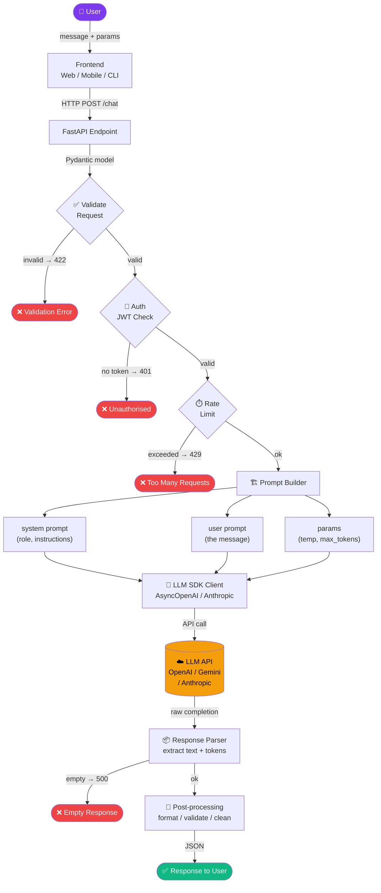
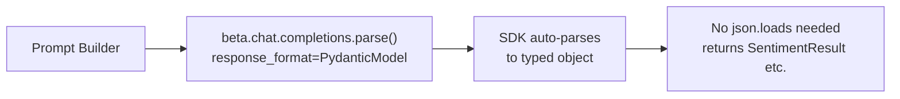

# P1 — Architecture Flow
### `Request → Prompt → LLM → Parse → Response`

← [Back to README](./README.md)

---

## 🔵 Visual Flow Diagram

> This diagram renders as a clickable flowchart in any Markdown viewer (VS Code, GitHub, Obsidian).



---

## 📋 Step-by-step: What happens at each node

### 1. User Request
The user sends a message. Could be from a web UI, mobile app, CLI, or API client.
- **What travels:** `{ message, system_prompt, temperature, max_tokens }`
- **Your control point:** none yet — raw input

---

### 2. FastAPI Endpoint
Receives the HTTP POST. Nothing smart happens here — just routing.
- **File:** `routers/chat.py`
- **Method:** `POST /chat`

---

### 3. Validate Request (Pydantic)
Pydantic automatically validates types, ranges, required fields.
```python
class ChatRequest(BaseModel):
    message: str = Field(min_length=1, max_length=10_000)
    temperature: float = Field(default=0.7, ge=0.0, le=2.0)
```
- **Pass:** moves to Auth
- **Fail:** automatic `422 Unprocessable Entity` — no code needed

---

### 4. Auth (JWT)
Decode the Bearer token. Check it's valid and not expired.
- **Pass:** `user dict` with `sub`, `role`, `tenant_id`
- **Fail:** `401 Unauthorized`

---

### 5. Rate Limiting
Check user hasn't exceeded their quota (e.g. 100 calls/hour).
- **Implement with:** Redis counter (`INCR user:ratelimit:sub`, TTL 3600)
- **Fail:** `429 Too Many Requests`

---

### 6. Prompt Builder ← YOUR MOST IMPORTANT SKILL
This is where you add value. Anyone can call an LLM. The prompt is the engineering.

```
system prompt:  who the LLM should be + rules + constraints
user prompt:    the actual user message
```

**Good system prompt structure:**
```
You are [ROLE].
Your job is to [TASK].
Rules:
- [rule 1]
- [rule 2]
Always respond in [FORMAT].
```

---

### 7. LLM SDK Call
Use the async client. Always set timeouts and retries.
```python
AsyncOpenAI(max_retries=3, timeout=60.0)
```
- `max_retries=3` handles transient `429` / `503` automatically
- `timeout=60.0` prevents hanging requests

---

### 8. Response Parser
Extract the text and token count from the raw completion object.
```python
content = response.choices[0].message.content   # the answer
tokens  = response.usage.total_tokens            # for cost tracking
```

---

### 9. Post-processing
Clean up before returning:
- `.strip()` the text
- Check it's not empty
- Format as JSON
- Log tokens (cost tracking)

---

### 10. Response to User
Return a clean `ChatResponse` Pydantic model:
```python
{ "answer": "...", "tokens_used": 123, "model": "gpt-4o" }
```

---

## 🔀 Variant: Structured Output Flow

When you need typed JSON back (not free-text), add this step after Prompt Builder:



Use case: sentiment classifier, entity extractor, data transformer.

---

## ➕ Add a new step to this flow

When something new comes — add it here as a new numbered section.
Keep the Mermaid diagram updated too (just add a node).

← [Back to README](./README.md) | [→ Code](./code.py) | [→ Cheatsheet](./cheatsheet.md)
