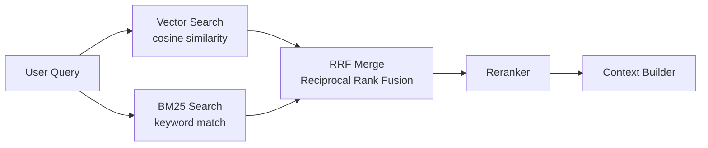

# P2 — Architecture Flow
### `Retrieve → Rank → Augment → Generate`

← [Back to README](./README.md)

---

## 🔵 Visual Flow Diagram

> This diagram renders as a clickable flowchart in any Markdown viewer (VS Code, GitHub, Obsidian).

```mermaid
flowchart TD
    subgraph INGEST["📥 INGESTION PIPELINE (run once)"]
        A([📄 Document Upload]) -->|"POST /ingest"| B[FastAPI Ingest Endpoint]
        B --> C{✅ File Valid?\next / size / MIME}
        C -->|invalid → 400| ERR1([❌ Bad File])
        C -->|valid| D[📄 Document Parser\npdfplumber / docx / txt]
        D --> E[✂️ Text Chunker\nsize=800 overlap=150]
        E --> F[🔢 Embed Chunks\ntext-embedding-3-small]
        F --> G[(🗄️ Vector Store\nFAISS / Pinecone upsert)]
        G --> DONE1([✅ Indexed])
    end

    subgraph QUERY["🔍 QUERY PIPELINE (per request)"]
        H([👤 User Question]) -->|"POST /query"| I[FastAPI Query Endpoint]
        I --> J{🔐 Token Valid?}
        J -->|no token → 401| ERR2([❌ Unauthorised])
        J -->|valid| K[🔢 Embed Query\nsame model as ingestion]
        K --> L[🔍 Vector Search\ncosine similarity · top-K]
        L --> M[📊 Reranker\ncross-encoder re-score]
        M --> N[📋 Context Builder\nassemble chunks + query]
        N --> O[🤖 LLM API Call\ngpt-4o temperature=0]
        O -->|LLM error → 500| ERR3([❌ LLM Error])
        O -->|ok| P[📨 Response\nanswer + source chunks]
        P --> DONE2([✅ Answer to User])
    end

    style DONE1 fill:#10b981,color:#fff
    style DONE2 fill:#10b981,color:#fff
    style ERR1 fill:#ef4444,color:#fff
    style ERR2 fill:#ef4444,color:#fff
    style ERR3 fill:#ef4444,color:#fff
    style G fill:#f59e0b,color:#000
    style N fill:#ec4899,color:#fff
```



---

## 📋 Step-by-step: What happens at each node

### INGESTION PIPELINE

### 1. Document Upload
User uploads a file (PDF, DOCX, TXT). The ingestion pipeline runs once (or when documents change).
- **What travels:** raw file bytes + filename
- **Endpoint:** `POST /ingest`

---

### 2. File Validation
Check extension, MIME type, and file size before doing any expensive work.
```python
ALLOWED_TYPES = {".txt", ".pdf", ".docx", ".md"}
MAX_FILE_SIZE = 20 * 1024 * 1024  # 20 MB
```
- **Fail:** `400 Bad Request` — unsupported type or too large

---

### 3. Document Parser
Extract clean text from the file format.
```python
# PDF
with pdfplumber.open(io.BytesIO(content)) as pdf:
    text = "\n".join(p.extract_text() or "" for p in pdf.pages)
# DOCX
doc = Document(io.BytesIO(content))
text = "\n".join(p.text for p in doc.paragraphs)
```

---

### 4. Text Chunker
Split text into overlapping chunks. Overlap ensures context is preserved at chunk boundaries.
```python
chunk_size = 800    # characters per chunk
overlap    = 150    # overlap between consecutive chunks
```
- **Why overlap?** A sentence at the end of chunk 1 and start of chunk 2 would be split without overlap. Overlap means the retriever always finds the full context.

---

### 5. Embed Chunks
Convert each chunk to a vector using the embedding model.
```python
resp = await llm.embeddings.create(model="text-embedding-3-small", input=batch)
```
- **Critical rule:** The embedding model here MUST be the same as the one used at query time. Different models produce incompatible vector spaces.

---

### 6. Vector Store (FAISS / Pinecone)
Store the vectors with their metadata (original text + source filename).
```python
faiss.normalize_L2(vecs)   # L2 normalise before storing
index.add(vecs)             # now inner product = cosine similarity
```

---

### QUERY PIPELINE

### 7. Embed Query
Convert the user's question to a vector — using the **same model** as ingestion.

---

### 8. Vector Search
Find the top-K most similar chunks by cosine similarity.
```python
scores, indices = index.search(query_vec, top_k=5)
```

---

### 9. Reranker ← KEY QUALITY STEP
Cross-encoder reranker re-scores each retrieved chunk with the full query as context.
```python
_reranker = CrossEncoder("cross-encoder/ms-marco-MiniLM-L-6-v2")
scores = _reranker.predict([(query, chunk) for chunk in chunks])
```
- **Why rerank?** Vector search optimises for recall (finds broadly relevant chunks). Reranker optimises for precision (sorts by actual relevance to THIS specific question). Together they give high recall + high precision.

---

### 10. Context Builder ← YOUR SKILL
Assemble the retrieved chunks into a structured prompt context.
```python
system = (
    "Answer ONLY from the context below. "
    "If the answer is not in the context, say 'I don't know.'\n\n"
    f"CONTEXT:\n{assembled_chunks}"
)
```
- **Rule:** Always instruct the LLM to say "I don't know" if the answer isn't in the context. Without this instruction, the LLM will hallucinate.

---

### 11. LLM Call
```python
temperature=0.0   # factual mode — no creativity
```

---

### 12. Response to User
Return answer + source citations (which chunk, which document, what relevance score).

---

## 🔀 Variant: Hybrid Search

When keyword match matters as much as semantic similarity:



Use: legal documents (exact clause matching), code search (exact function names).

---

## ➕ Add a new step to this flow

When something new comes — add it here as a new numbered section.

← [Back to README](./README.md) | [→ Code](./code.py) | [→ Cheatsheet](./cheatsheet.md)
