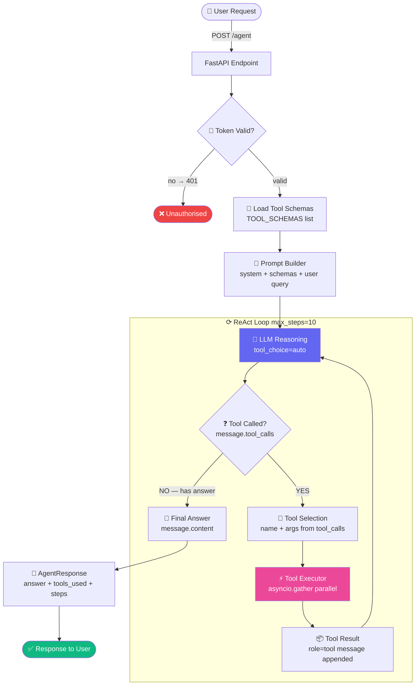
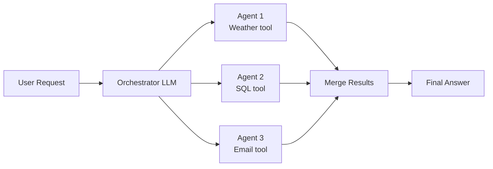

# P3 — Architecture Flow
### `Think → Tool → Result → Think → Answer`

← [Back to README](./README.md)

---

## 🔵 Visual Flow Diagram

> This diagram renders as a clickable flowchart in any Markdown viewer (VS Code, GitHub, Obsidian).



---

## 📋 Step-by-step: What happens at each node

### 1. User Request
User sends a natural-language request that may require external data or actions.
- **Example:** "What's the weather in Mumbai and email the report to alice@example.com?"
- **Endpoint:** `POST /agent`

---

### 2. Auth (JWT)
Validate Bearer token. Same as P1.
- **Fail:** `401 Unauthorized`

---

### 3. Load Tool Schemas
`TOOL_SCHEMAS` is the JSON Schema list that tells the LLM what tools exist.
```python
TOOL_SCHEMAS = [
    {
        "type": "function",
        "function": {
            "name": "get_weather",
            "description": "Get current weather for a city",
            "parameters": { ... }
        }
    }
]
```
- The LLM reads this to know: what tools are available, what arguments each takes, what each does.

---

### 4. Prompt Builder
Build the initial messages list with system instructions and the user query.
Tool schemas are passed as a separate `tools=` parameter to the LLM call — not in the messages.

---

### 5. LLM Reasoning (Think) ← HEART OF THE LOOP
```python
response = await llm.chat.completions.create(
    model="gpt-4o",
    messages=messages,
    tools=TOOL_SCHEMAS,
    tool_choice="auto",   # LLM decides: call a tool, or answer directly
)
```
The LLM returns either:
- `message.tool_calls` → it wants to call tools (ACT)
- `message.content` → it has the final answer (DONE)

---

### 6. Tool Called? (Decision gate)
```python
if not message.tool_calls:
    return message.content.strip(), tools_used, step + 1
```
This is the exit condition for the loop.

---

### 7. Tool Selection
Extract name and arguments from each tool call:
```python
name = tool_call.function.name
args = json.loads(tool_call.function.arguments)
```

---

### 8. Tool Executor ← YOUR SKILL
Execute ALL tools from this response **concurrently**:
```python
await asyncio.gather(*[execute_tool_call(tc) for tc in message.tool_calls])
```
- One LLM response can request multiple tools at once
- `asyncio.gather` runs them in parallel — same as Java `CompletableFuture.allOf()`
- `TOOL_REGISTRY` maps name → function for safety (unknown names return error JSON)

---

### 9. Tool Result
Each result is appended to messages with `role="tool"`:
```python
{
    "role": "tool",
    "tool_call_id": tool_call.id,   # must match the request ID
    "content": json.dumps(result),
}
```
The LLM sees this in the next reasoning step.

---

### 10. Loop Back
The loop continues until either:
- `message.tool_calls` is None → LLM has the final answer
- `step == max_steps` → safety cutoff (returns partial answer)

---

### 11. AgentResponse
```python
class AgentResponse(BaseModel):
    answer:     str
    tools_used: list[str]   # ["get_weather", "send_email"]
    steps:      int         # how many reasoning steps
```

---

## 🔀 Variant: Parallel Multi-Agent

When different sub-tasks are independent:



Use: complex requests that can be decomposed into independent parallel tasks.

---

← [Back to README](./README.md) | [→ Code](./code.py) | [→ Cheatsheet](./cheatsheet.md)
