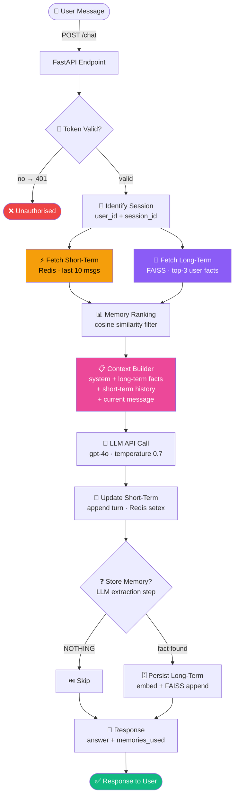
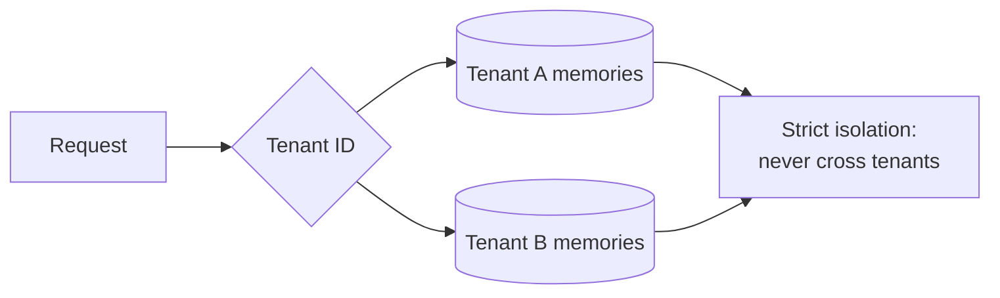

# P4 — Architecture Flow
### `Retrieve → Context Build → LLM → Store`

← [Back to README](./README.md)

---

## 🔵 Visual Flow Diagram

> This diagram renders as a clickable flowchart in any Markdown viewer (VS Code, GitHub, Obsidian).



---

## 📋 Step-by-step: What happens at each node

### 1. User Message
User sends a message. Could be in the middle of an ongoing conversation. The system needs to know WHO they are and WHAT they've said before.
- **What travels:** `{ message, session_id }`
- **Endpoint:** `POST /chat`

---

### 2. Auth (JWT)
Validate token and extract `user_id` (from JWT `sub` claim). This is the key for long-term memory.
- `user_id` → long-term memory key (persists across sessions)
- `session_id` → short-term memory key (scoped to this conversation)

---

### 3. Identify Session
The two IDs serve different purposes:
```python
user_id    = user["sub"]       # from JWT — same person across all sessions
session_id = req.session_id    # from request — this specific conversation
```

---

### 4. Fetch Short-Term Memory (Redis)
```python
raw = await redis.get(f"session:{session_id}")
messages = json.loads(raw) if raw else []
# Returns: last 10 [{"role": "user", "content": ...}, ...]
```
- Sliding window of last `SHORT_TERM_LIMIT=10` messages
- TTL of 1 hour — old sessions expire automatically
- No short-term memory on first message → empty list → that's fine

---

### 5. Fetch Long-Term Memory (FAISS)
```python
# Embed the current query
q_vec = await embed_text(query, llm)
# Search user's FAISS index for most relevant past facts
_, indices = index.search(q_vec, k=3)
# Returns: [MemoryEntry(content="User prefers Python over Java"), ...]
```
- Cosine similarity between query and stored facts
- Only retrieves **relevant** memories — not ALL memories
- Same principle as RAG: retrieve only what's needed, not everything

---

### 6. Memory Ranking
FAISS already returns results sorted by cosine similarity.
Short-term is already sorted by time (most recent = most relevant).
Optional: hybrid re-rank combining recency + semantic score.

---

### 7. Context Builder ← YOUR SKILL
Assemble everything into a coherent LLM context:
```python
messages = [
    {
        "role": "system",
        "content": "You are a helpful personalized assistant.\n\n"
                   "What you know about this user:\n"
                   "- User prefers Python over Java\n"
                   "- User is a senior backend engineer\n"
    },
    {"role": "user",      "content": "How was Paris?"},   # short-term history
    {"role": "assistant", "content": "Loved it! ..."},
    {"role": "user",      "content": req.message},        # current message
]
```
- Long-term facts go in the system prompt
- Short-term history goes as alternating user/assistant messages
- Current message is always last

---

### 8. LLM Call
```python
temperature=0.7   # conversational — slight creativity is fine
```

---

### 9. Update Short-Term Memory
Always runs — no decision gate. Every turn is saved back to Redis immediately:
```python
short_term.append({"role": "user",      "content": req.message})
short_term.append({"role": "assistant", "content": answer})
await redis.setex(f"session:{session_id}", 3600, json.dumps(short_term[-10:]))
```

---

### 10. Store Memory? (Decision gate) ← THE FEEDBACK LOOP
Ask the LLM if anything is worth remembering long-term:
```python
# Prompt: "Extract ONE fact worth remembering. If nothing, reply: NOTHING"
result = await llm.chat.completions.create(...)
# Returns: "User prefers bullet-point responses" OR "NOTHING"
```
- `NOTHING` → skip (most turns have nothing worth storing)
- Fact found → embed it and append to FAISS

---

### 11. Response to User
```python
ChatResponse(answer=answer, session_id=req.session_id, memories_used=len(long_term))
```
`memories_used` tells you how many long-term facts influenced this response — useful for debugging.

---

## 🔀 Variant: Multi-Tenant Memory Isolation

In production with multiple users/tenants:



Key: scope ALL memory reads/writes by `user_id` or `tenant_id`. Never let Tenant A's memories appear in Tenant B's context.

---

← [Back to README](./README.md) | [→ Code](./code.py) | [→ Cheatsheet](./cheatsheet.md)
