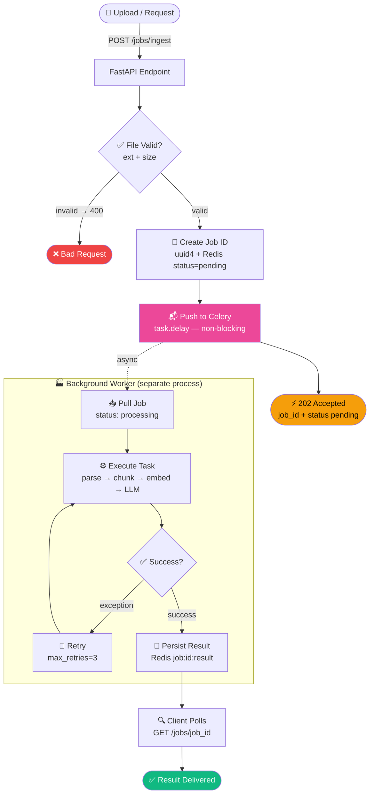

# P5 — Architecture Flow
### Part A: `Generate → Push Token → Repeat` · Part B: `Accept → Queue → Worker → Status`

← [Back to README](./README.md)

---

## 🔵 Part A — SSE Streaming Flow

> Real-time token streaming: ChatGPT typing effect.

```mermaid
flowchart TD
    A([👤 User Request]) -->|"POST /stream"| B[FastAPI Streaming Endpoint]
    B --> C{🔐 Token Valid?}
    C -->|no → 401| ERR1([❌ Unauthorised])
    C -->|valid| D[📝 Prompt Builder\nsystem + user → messages]
    D --> E[🤖 LLM Streaming Call\nstream=True → async iterator]

    subgraph STREAM["🔁 Token Stream Loop"]
        E --> F[📡 Receive Token\nchunk.choices\[0\].delta.content]
        F --> G[📤 SSE Format\n'data: {token}\\n\\n']
        G --> H[🖥️ Browser Receives\nEventSource.onmessage]
        H -->|next chunk| F
    end

    G -->|"data: \[DONE\]\\n\\n"| DONE1([✅ Stream Complete])

    style DONE1 fill:#10b981,color:#fff
    style ERR1 fill:#ef4444,color:#fff
    style G fill:#ec4899,color:#fff
```

---

## 🔵 Part B — Async Jobs Flow

> Long-running tasks: accept immediately, process in background.



---

## 📋 Part A — Step-by-step

### 1. FastAPI Streaming Endpoint
Returns `StreamingResponse` wrapping an async generator. Not a normal JSON response.
```python
return StreamingResponse(
    sse_event_stream(messages, llm),
    media_type="text/event-stream",
    headers={"X-Accel-Buffering": "no"},   # CRITICAL: disables Nginx buffering
)
```

---

### 2. LLM Streaming Call
```python
stream = await llm.chat.completions.create(model="gpt-4o", messages=messages, stream=True)
async for chunk in stream:
    token = chunk.choices[0].delta.content
```
- `stream=True` makes the API return an async iterator instead of a complete response
- Each `chunk` contains one or a few tokens
- The generator yields each token immediately as it arrives

---

### 3. SSE Format ← YOUR SKILL
```python
safe = token.replace("\n", "\\n")    # escape newlines — they break SSE delimiter
yield f"data: {safe}\n\n"            # double newline = end of SSE event
```
SSE rules:
- Each event: `data: <content>\n\n` (double newline terminates the event)
- Signal done: `data: [DONE]\n\n`
- Content filters can block tokens — wrap in try/except

---

### 4. Browser EventSource
```javascript
const source = new EventSource('/stream');
source.onmessage = (e) => {
    if (e.data === '[DONE]') { source.close(); return; }
    output.innerText += e.data.replace(/\\n/g, '\n');
};
```

---

## 📋 Part B — Step-by-step

### 1. Submit Endpoint (202 Accepted)
```python
job_id = str(uuid.uuid4())
await redis.set(f"job:{job_id}:status", "pending")
process_document_task.delay(job_id, text, file.filename)   # non-blocking
return JobResponse(job_id=job_id, status="pending")        # immediate response
```
- `task.delay()` pushes to Celery queue and returns immediately
- HTTP 202 = "I got it, I'm working on it" (not 200 = done)

---

### 2. Celery Worker (separate process)
```python
@celery_app.task(bind=True, max_retries=3, default_retry_delay=30)
def process_document_task(self, job_id, file_content, filename):
    r.set(f"job:{job_id}:status", "processing")
    # ... heavy processing ...
    r.set(f"job:{job_id}:status", "success")
```
- Runs in a **completely separate process** from FastAPI
- `bind=True` gives access to `self.retry(exc=exc)` for retries
- Status transitions: `pending → processing → success / failed`

---

### 3. Status Endpoint (client polls this)
```python
GET /jobs/{job_id}
# Returns: {"job_id": "...", "status": "processing", "result": null}
# Returns: {"job_id": "...", "status": "success", "result": {...}}
```
- Frontend polls every 2–5 seconds until `status == "success"` or `"failed"`

---

## 🔀 Variant: Combined Pattern (P5 Full)

Submit + stream in one connection:
```
POST /submit-stream
→ SSE event 1: {"job_id": "uuid", "status": "queued"}
→ SSE event 2: {"node": "parse", "status": "started"}
→ SSE event 3: {"node": "embed", "status": "done", "chunks": 42}
→ SSE event 4: {"status": "success", "result": {...}}
```
Subscribe to event bus **before** pushing to queue — so no events are missed in the race.

---

← [Back to README](./README.md) | [→ Code](./code.py) | [→ Cheatsheet](./cheatsheet.md)
